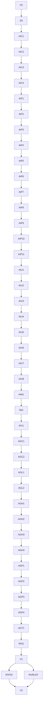

<!-- migration-document-status: SUPERSEDED / HISTORICAL -->

> Superseded AI/Agent consolidation blueprint. Use `docs/porting/BASELINE.md` and `.agents/plans/pi-stage-1-port-recovery.md`.

# Zedflow AI and Agent Pi Fidelity Consolidation

<a id="how-to-use"></a>
## How to use this plan

This plan is self-contained for orchestration by a fresh agent session.

- All implementation subagents must run in fresh context.
- Execute only assignable unit IDs listed in the orchestration waves.
- Before launching a unit, pass its full `Subagent prompt` plus the relevant plan references from `Canonical Line References`.
- Do not infer requirements from outside this plan and the listed references.
- Do not execute neighboring task scopes.
- If a unit is marked `non-validating`, do not run global validation or add compatibility workarounds to make the repo compile.
- Only units marked `integration-validating` own global validation gates.
- If blocked by missing context or unexpected codebase reality, report the blocker and stop instead of inventing a workaround.

<a id="legend"></a>
## Legend

### Execution

- `fresh`: subagent receives only the prompt, this plan, and listed references.
- `sequential`: must run after listed dependencies.
- `parallel`: may run in the same orchestration wave only in isolated clean worktrees.
- `Assignable: yes`: this unit may be launched as a subagent task.
- `Assignable: no`: this unit is a container or explanatory grouping only.

### Validation responsibility

- `non-validating`: do not run global compile/lint/test gates; only perform explicitly listed local checks.
- `locally-validating`: validate only the owned scope.
- `integration-validating`: owns broader compile/lint/test/integration gates.

### Artifact tags

- `[CANONICAL]`: required shape; preserve unless implementation evidence contradicts it.
- `[ILLUSTRATIVE]`: explains intent; adapt to local architecture.

### Review flag types

- `BQ`: blocking question requiring human decision before affected work.
- `OQ`: non-blocking open question.
- `C`: contradiction or ambiguity.
- `R`: implementation risk / watch item.

### File actions

- `create`: file must be created.
- `modify`: file must be edited.
- `delete`: file must be removed.
- `read`: file/reference must be read before editing.

<a id="goal"></a>
## Goal

Restore observable fidelity between `references/pi/packages/ai` and `crates/zedflow-ai`, and between `references/pi/packages/agent` and `crates/zedflow-agent`, before the global Pi-to-Rust port advances. Deterministic Pi behavior must be executable in Rust; live behavior must have production-path captured transport tests and capability-gated live attestation; Rust-only adaptations must preserve Pi event, error, abort, persistence, hook, queue, and stream semantics.

<a id="non-goals"></a>
## Non-goals

- Do not implement Zedflow Flow, Runtime Graph, LangGraph, coding-agent, CLI, or TUI behavior.
- Do not add old-monolith compatibility shims or duplicate `zedflow-ai` message/model/tool/event types in `zedflow-agent`.
- Do not make `zedflow_ai::StreamFunction` asynchronous; Pi AI returns a stream immediately.
- Do not reproduce Node-only observability that Rust cannot expose, such as exact dynamic-import hook observations or lone UTF-16 surrogate values in `str`.
- Do not weaken, delete, rename, newly ignore, or relabel parity tests to make gates pass.
- Do not require unavailable credentials for deterministic acceptance, and never print or persist secrets.

<a id="decisions"></a>
## Approved Decisions

- Full fidelity means every deterministic observable Pi behavior is active and tested. JS-only and upstream-skipped cases may remain attested; live tests without capability report `not-run: capability missing`, never `passed`.
- Every live/provider path must also have deterministic captured HTTP/SSE/WebSocket tests using the production serializer and parser.
- API-breaking callback, stream, session, and patch corrections are approved because downstream `zedflow-coding-agent` work has not been accepted yet.
- `zedflow_ai::StreamFunction` remains immediate; `zedflow-agent` owns its broader async custom stream setup contract.
- `zedflow-agent` uses the current Tokio handle when present and a crate-private current-thread fallback runtime otherwise; no public executor abstraction is introduced.
- UUIDv7 ports Pi's exact monotonic algorithm with injectable clock/random seams for deterministic tests.
- `command-group = "5.0.1"` is the selected safe process-group replacement; it supports Unix process groups, Windows job objects, Rust 1.68+, and MIT/Apache-2.0.
- Implementation writers are sequential in the current dirty worktree. Parallel writers are allowed only after a clean checkpoint and with isolated worktrees.
- Complete the canonical lazy/compat unification AI-C4, AI-P1 through AI-P11, AI-U1 through AI-U8, AI-M1, and R-AI before running AI-V1 as the final `zedflow-ai` acceptance gate; begin AG-C1 only after AI-V1 is GO. Do not retain a duplicate lazy type/stream universe or duplicate work owned by provider units.

<a id="review-flags"></a>
## Review Flags

| ID | Type | Severity | Summary | Affects | Follow-up / accepted risk |
|---|---|---:|---|---|---|
| RF-API-BREAK | R | High | Fallible hooks/tools, async agent stream setup, event sinks, session setters, and tri-state patches change public Rust APIs. | AI-C1, AG-C1, AG-C2, downstream crates | Land before coding-agent; forbidden workaround is retaining old APIs beside corrected ones. |
| RF-DIRTY-WORKTREE | R | High | The repository contains extensive inherited unstaged work. | All writers | One writer at a time; never revert/stage unrelated files; isolated worktrees only after a clean checkpoint. |
| RF-LIVE-CAPABILITY | R | Medium | Live provider attestation depends on credentials/network. | AI-P1-AI-P11, AI-M1, V1 | Deterministic production-path capture is mandatory; unavailable live runs are reported separately. |
| RF-JS-ONLY | R | Low | Dynamic imports and lone UTF-16 surrogates have no exact Rust observable. | AI-M1, AG-T1 | Keep exact attestation and test the nearest observable Rust behavior; do not invent emulation. |
| RF-RUNTIME | R | High | A sync-returning live agent stream needs background execution without nested `block_on`. | AG-C1, AG-L1, AG-P3 | Use current Tokio handle or a private fallback runtime; prove immediate return and delayed event delivery. |
| RF-PROCESS-TREE | R | Medium | Process-tree termination differs across Unix and Windows. | D0, AG-P2 | Use `command-group`; require platform-gated child+grandchild tests and CI report. |
| RF-TEST-BASELINE | C | High | Current manifests show 98 AI test rows, 29 missing Rust targets, and the latest runtime report shows 78 ignored attributes. | F0, AI provider/test units, AI-M1 | Pin exact row/function ledgers before edits and gate final set equality. |
| RF-PROVIDER-SCOPE | R | High | Provider transports are large and share core hook/auth/catalog contracts. | AI-C1-AI-C3, AI-P1-AI-P11 | Stabilize core contracts first; provider units are sequential and file-bounded. |

<a id="global-acceptance"></a>
## Global Acceptance Criteria

- `.agents/port-manifests/ai-src.tsv`, `ai-tests.tsv`, `agent-src.tsv`, and `agent-tests.tsv` have zero missing target files.
- All 29 currently missing AI test targets contain equivalent assertions, not empty shells or blanket ignored tests.
- No `#[ignore]` reason in either crate names an implementation blocker, placeholder, missing transport, missing runtime, or missing deterministic seam.
- Remaining ignores are only exact JS-only, upstream-skipped, manual-browser, or capability-gated live cases recorded in the final ledger.
- Streams return immediately, deliver ordered delayed events, emit exactly one terminal event, suppress post-terminal events, and reconstruct the Pi-equivalent final result.
- Abort works before dispatch, mid-text, mid-tool JSON, during agent execution, during proxy transport, and during process execution; no later deltas or descendant processes remain.
- Tool preparation/validation/before/execute/after failures become Pi-equivalent error tool results without panic; replacement arguments reach execution.
- Harness writes flush in order before save points, next-turn state, settlement, and idle resolution; failures are surfaced and unwritten items are retained.
- `zedflow-agent` reuses canonical `zedflow-ai` model/message/tool/event/stream primitives.
- Public fallible Rust APIs have source-preserving errors and `# Errors` documentation.
- `make -C crates/zedflow-agent fmt check test test:harness doc package` succeeds; coverage runs when `cargo-llvm-cov` is installed.
- Crate fmt/check/test/doc/clippy gates and final workspace fmt/check/test-no-run/deterministic-test gates pass using external target directories.
- Final reports distinguish deterministic parity, live passed/failed/not-run capability results, JS-only attestations, and upstream skips.
- Every live test maps to a named deterministic companion that exercises the production serializer/parser; capability-present live failures are blockers, while capability-absent runs are `not-run: capability missing`.
- Every JS-only entry cites an active nearest-observable Rust test and result, or explicitly proves that no Rust-observable analogue exists.

<a id="legacy-policy"></a>
## Legacy / workaround policy

- No temporary aliases unless explicitly listed as allowed in a task.
- No compatibility shims unless they are the goal of a task.
- No type weakening to satisfy intermediate compilation.
- No preserving legacy names when the planned change is a removal or rename.
- Do not expand a task scope to fix breakages assigned to later units.
- If blocked, report the breakage and reference the downstream unit responsible.
- No second message/model/tool/stream universe in `zedflow-agent`.
- No test-only serializer, transport, production branch, fake terminal success, broad lint allow, or new ignore.

<a id="breaking-changes"></a>
## Planned Breaking Changes and Propagation Map

| Change | Introduced by | Expected temporary breakage | Fixed by | Forbidden workaround |
|---|---|---|---|---|
| AI payload/response hooks return typed `Result`. | AI-C1 | Provider implementations and harness adapters fail to compile. | AI-C1 propagation, AG-H2 | Parallel infallible hook aliases. |
| Agent custom `StreamFn` supports async setup and failure while AI `StreamFunction` remains immediate. | AG-C1 | Agent loop, facade, harness, tests need adaptation. | AG-L1, AG-L2, AG-H2 | Changing canonical AI stream contract or retaining `block_on`. |
| Tool execution becomes required/fallible and tool hooks become fallible with explicit argument replacement. | AG-C1 | Existing tool fixtures and harness tools fail. | AG-L1, AG-H2, AG-T1 | Optional executor or panic-based error signaling. |
| Event sinks/listeners can fail. | AG-C1 | Agent/harness lifecycle adapters fail. | AG-L2, AG-H1, AG-H4 | Dropping errors with `.ok()` or `let _ =`. |
| Session leaf writes become fallible and error causes become source-preserving. | AG-C2 | Storage/session implementations and tests fail. | AG-C2, AG-P1 | Non-fallible wrapper or string-only cause. |
| Stream option patches become tri-state. | AG-C2 | Harness option hooks/tests fail. | AG-H2 | Nested `Option` ambiguity or sentinel values. |
| Node execution uses process groups and no longer relies on direct-child `wait-timeout`. | AG-P2 | Process spawn/wait/kill code changes. | AG-P2 | Direct-child kill fallback presented as parity. |

<a id="verified-baseline"></a>
## Verified Baseline

- AI source manifest: 148 rows, 0 missing targets.
- AI test manifest: 98 rows, 29 missing targets.
- Agent source manifest: 25 rows, 0 missing targets.
- Agent test manifest: 20 rows, 0 missing targets.
- Latest AI deterministic result: 730 passed, 78 ignored, 15 filtered; current acceptance is not full.
- Current agent deterministic result: 115 passed, 6 ignored; behavior audit found blocking stream/tool/harness/lifecycle drift.

The 29 missing AI targets are grouped by owner:

| Owner | Missing targets |
|---|---|
| AI-P1 | `anthropic-cache-write-1h-cost.rs`, `anthropic-eager-tool-input-compat.rs`, `anthropic-force-adaptive-thinking.rs` |
| AI-P5 | `google-shared-convert-tools.rs`, `google-shared-gemini3-unsigned-tool-call.rs`, `google-shared-image-tool-result-routing.rs`, `google-thinking-signature.rs` |
| AI-P6 | `google-vertex-api-key-resolution.rs` |
| AI-P7 | `mistral-reasoning-mode.rs`, `mistral-tool-schema.rs` |
| AI-P8 | `openai-completions-prompt-cache.rs`, `openai-completions-reasoning-details.rs`, `openai-completions-retry.rs`, `openai-completions-thinking-as-text.rs`, `openai-completions-tool-result-images.rs` |
| AI-P9 | `openai-responses-copilot-provider.rs`, `openai-responses-foreign-toolcall-id.rs`, `openai-responses-message-id.rs`, `openai-responses-partial-json-cleanup.rs`, `transform-messages-copilot-openai-to-anthropic.rs` |
| AI-P11 | `openrouter-images.rs` |
| AI-U1-AI-U8 | `compat-env.rs`, `error-body.rs`, `fireworks-models.rs`, `lax-message-content.rs`, `oauth-device-code.rs`, `overflow.rs`, `retry.rs`, `validation.rs` |

<a id="orchestration"></a>
## Subagent Orchestration Plan

- W0: F0, then D0. (complete)
- W1: AI-C1, AI-C2, AI-C3, then AI-C4 canonical unification.
- W2: AI-P1 through AI-P11 sequentially in numeric order.
- W3: AI-U1 through AI-U8 sequentially, then AI-M1.
- W4: R-AI, then AI-V1 as the final AI acceptance gate.
- W5: AG-C1, then AG-C2.
- W6: AG-L1, then AG-L2.
- W7: AG-H1, AG-H2, AG-H3, AG-H4 sequentially.
- W8: AG-P1, AG-P2, AG-P3, AG-P4, AG-T1 sequentially.
- W9: R-AG, V1, then RV-FID and RV-RUST in parallel as fresh read-only reviewers, then V2.



<a id="parallelization-constraints"></a>
## Parallelization Constraints

| Constraint | Reason | Affected units |
|---|---|---|
| Default implementation execution is sequential. | Current worktree is dirty and multiple writers in one worktree are unsafe. | All implementation units |
| Parallel writers require clean isolated worktrees and explicit orchestrator confirmation. | Disjoint file scopes alone do not protect shared Cargo/module state. | Provider and utility units |
| `agent-harness.rs` writers are strictly sequential. | Four units intentionally evolve one integration file. | AG-H1-AG-H4 |
| AI provider units follow completed AI-C1-C4 and precede all agent units. | Hook/auth/catalog/faux and canonical lazy/compat contracts must be stable before leaf transports, and full AI acceptance now gates AG-C1. | AI-P1-AI-P11 |
| Only integration units run broad gates. | Intermediate contract units may intentionally break dependents. | AI-V1, AG-H4, AI-M1, V1 |
| Reviewers are fresh and read-only. | Preserve one-writer control while allowing adversarial review. | RV-FID, RV-RUST |

<a id="canonical-line-references"></a>
## Canonical Line References

<!-- CANONICAL_LINE_REFERENCES_START -->
<!-- This block is generated from document anchors. Do not edit manually. -->
| ID | Anchor | Lines | Description |
|---|---|---|---|
| how-to-use | #how-to-use | L3-L16 | How to use this plan |
| legend | #legend | L17-L52 | Legend |
| goal | #goal | L53-L57 | Goal |
| non-goals | #non-goals | L58-L67 | Non-goals |
| decisions | #decisions | L68-L80 | Approved Decisions |
| review-flags | #review-flags | L81-L94 | Review Flags |
| global-acceptance | #global-acceptance | L95-L113 | Global Acceptance Criteria |
| legacy-policy | #legacy-policy | L114-L125 | Legacy / workaround policy |
| breaking-changes | #breaking-changes | L126-L138 | Planned Breaking Changes and Propagation Map |
| verified-baseline | #verified-baseline | L139-L161 | Verified Baseline |
| orchestration | #orchestration | L162-L189 | Subagent Orchestration Plan |
| parallelization-constraints | #parallelization-constraints | L190-L201 | Parallelization Constraints |
| canonical-line-references | #canonical-line-references | L202-L271 | Canonical Line References |
| phases-and-tasks | #phases-and-tasks | L272-L2862 | Phases and Tasks |
| F0 | #F0 | L275-L336 | Task F0 — Pin parity ledgers |
| D0 | #D0 | L337-L393 | Task D0 — Dependency scaffold |
| AI-C1 | #AI-C1 | L394-L462 | Task AI-C1 — Fallible provider hook contracts |
| AI-C2 | #AI-C2 | L463-L523 | Task AI-C2 — Models, auth, catalog, and dispatch semantics |
| AI-C3 | #AI-C3 | L524-L581 | Task AI-C3 — Asynchronous faux provider fidelity |
| AI-C4 | #AI-C4 | L582-L645 | Task AI-C4 — Canonical lazy/compat type and stream unification |
| AI-V1 | #AI-V1 | L646-L703 | Task AI-V1 — Final AI acceptance and agent prerequisite gate |
| AG-C1 | #AG-C1 | L704-L760 | Task AG-C1 — Agent callback, tool, stream, and event contracts |
| AG-C2 | #AG-C2 | L761-L825 | Task AG-C2 — Harness/session error and patch contracts |
| AG-L1 | #AG-L1 | L826-L884 | Task AG-L1 — Live agent loop and tool failure normalization |
| AG-L2 | #AG-L2 | L885-L942 | Task AG-L2 — Atomic Agent lifecycle |
| AG-H1 | #AG-H1 | L943-L1000 | Task AG-H1 — Harness persistence and save-point ordering |
| AG-H2 | #AG-H2 | L1001-L1059 | Task AG-H2 — Harness hooks and stream option semantics |
| AG-H3 | #AG-H3 | L1060-L1118 | Task AG-H3 — Harness compaction and branch provenance |
| AG-H4 | #AG-H4 | L1119-L1176 | Task AG-H4 — Harness wait, abort, and settlement |
| AG-P1 | #AG-P1 | L1177-L1232 | Task AG-P1 — Exact monotonic UUIDv7 |
| AG-P2 | #AG-P2 | L1233-L1289 | Task AG-P2 — Cross-platform process-tree execution |
| AG-P3 | #AG-P3 | L1290-L1347 | Task AG-P3 — Proxy HTTP/SSE transport |
| AG-P4 | #AG-P4 | L1348-L1402 | Task AG-P4 — IANA timezone test utility parity |
| AG-T1 | #AG-T1 | L1403-L1462 | Task AG-T1 — Agent test fidelity closure |
| AI-P1 | #AI-P1 | L1463-L1522 | Task AI-P1 — Anthropic transport and missing deterministic tests |
| AI-P2 | #AI-P2 | L1523-L1579 | Task AI-P2 — GitHub Copilot Anthropic path |
| AI-P3 | #AI-P3 | L1580-L1635 | Task AI-P3 — OpenAI Codex compression closure |
| AI-P4 | #AI-P4 | L1636-L1693 | Task AI-P4 — Bedrock error-body closure |
| AI-P5 | #AI-P5 | L1694-L1752 | Task AI-P5 — Google shared and Generative AI parity |
| AI-P6 | #AI-P6 | L1753-L1812 | Task AI-P6 — Google Vertex parity |
| AI-P7 | #AI-P7 | L1813-L1869 | Task AI-P7 — Mistral parity |
| AI-P8 | #AI-P8 | L1870-L1927 | Task AI-P8 — OpenAI Completions parity |
| AI-P9 | #AI-P9 | L1928-L1985 | Task AI-P9 — OpenAI Responses and transform parity |
| AI-P10 | #AI-P10 | L1986-L2042 | Task AI-P10 — Azure OpenAI Responses parity |
| AI-P11 | #AI-P11 | L2043-L2102 | Task AI-P11 — Images and OpenRouter image parity |
| AI-U1 | #AI-U1 | L2103-L2153 | Task AI-U1 — Compat environment test row |
| AI-U2 | #AI-U2 | L2154-L2195 | Task AI-U2 — Error-body test row |
| AI-U3 | #AI-U3 | L2196-L2237 | Task AI-U3 — Fireworks model row |
| AI-U4 | #AI-U4 | L2238-L2279 | Task AI-U4 — Lax message content row |
| AI-U5 | #AI-U5 | L2280-L2321 | Task AI-U5 — OAuth device-code row |
| AI-U6 | #AI-U6 | L2322-L2363 | Task AI-U6 — Overflow row |
| AI-U7 | #AI-U7 | L2364-L2405 | Task AI-U7 — Retry row |
| AI-U8 | #AI-U8 | L2406-L2447 | Task AI-U8 — Tool validation row |
| AI-M1 | #AI-M1 | L2448-L2508 | Task AI-M1 — AI manifest and ignore closure |
| R-AI | #R-AI | L2509-L2565 | Task R-AI — Zedflow AI Rust cleanup |
| R-AG | #R-AG | L2566-L2624 | Task R-AG — Zedflow Agent Rust cleanup |
| V1 | #V1 | L2625-L2686 | Task V1 — Final cross-crate and workspace validation |
| RV-FID | #RV-FID | L2687-L2745 | Task RV-FID — Fresh Pi fidelity review |
| RV-RUST | #RV-RUST | L2746-L2803 | Task RV-RUST — Fresh Rust quality review |
| V2 | #V2 | L2804-L2862 | Task V2 — Final acceptance synthesis |
| pre-finalization-review | #pre-finalization-review | L2863-L2870 | Pre-finalization Review Summary |
<!-- CANONICAL_LINE_REFERENCES_END -->

<a id="phases-and-tasks"></a>
## Phases and Tasks

<a id="F0"></a>
### Task F0 — Pin parity ledgers

Assignable: yes

Execution metadata:
- Wave: W0
- Context: fresh
- Depends on: none
- Can run in parallel with: none
- Must not run in parallel with: all writers

Scope boundaries:
- Goal: Create an exact execution ledger for 98 AI test rows, 29 missing targets, 78 current ignores, 20 agent test rows, and six agent ignores.
- Non-goals: No Rust edits and no reclassification without Pi evidence.
- Forbidden work: No cargo validation, test edits, or placeholder cleanup.

Files:
| Action | Path | Purpose |
|---|---|---|
| create | `.agents/state/zedflow-ai-agent-full-fidelity-test-ledger.md` | Row/function baseline, owner, classification, expected behavior, companion production-path capture, exact live command, outcome, JS-only analogue, and disposition. |
| read | `.agents/port-manifests/{ai,agent}-{src,tests}.tsv` | Set-equality baseline. |
| read | `.agents/state/zedflow-ai-pi-ai-runtime-drift-final-report.md` | Exact 78-ignore baseline. |
| read | `.agents/state/zedflow-agent-consolidation-audit.md` | Agent behavior/test baseline. |
| read | `references/pi/packages/{ai,agent}/test/**/*` | Behavioral source of truth. |

Required context package:
- Plan references: goal, approved decisions, RF-TEST-BASELINE, verified baseline, F0.
- Required skills: rust-skills for test-quality classification only.
- Required files/symbols to read: every manifest row and every current ignore attribute.
- Required URLs/docs: none.
- Dependency outputs to read: none.
- Neighboring out-of-scope units: all implementation units.

Implementation outline:
1. Compute manifest target set equality.
2. Record every missing target and every ignored test function with exact Pi reference and one classification: `deterministic-to-activate`, `live-capability`, `JS-only`, or `upstream-skipped`.
3. For each live row, record the companion deterministic test that exercises the same production serializer/parser, the exact live command, capability probe, and expected per-test outcome.
4. For each JS-only row, record the active nearest-observable Rust test/result or prove no Rust-observable analogue exists.
5. Assign every deterministic row/function to one plan unit.

Validation responsibility:
- Type: non-validating
- Must run: read/grep/Python inventory scripts only.
- Must NOT run: cargo commands or live tests.
- Expected temporary breakage: none.
- Forbidden fixes/workarounds: editing source/tests to alter counts.

Output contract:
- Exact ledger path, counts, owner mapping, live-to-captured mapping, live commands/outcomes, JS-only analogue mapping, and contradictions.

Acceptance criteria:
- Set equality and per-function classification are reproducible; no vague `BLOCKER` category remains; no live path or JS-only classification is unmapped.

Handoff to dependent units:
- Every later unit reads its owned ledger rows; AI-M1 and V1 consume the final ledger.

Subagent prompt:
```text
You are implementing only F0 from .agents/plans/zedflow-ai-agent-pi-fidelity-consolidation.md in fresh context. Read the plan baseline/flags/F0, both manifests, the latest AI drift report, the agent consolidation audit, and matching Pi tests. Create only .agents/state/zedflow-ai-agent-full-fidelity-test-ledger.md. Pin all rows and ignore functions with exact behavior, classification, owner, companion production-path captured test, exact live command/capability/outcome, JS-only nearest observable analogue, and disposition. Do not edit Rust or run cargo/live tests.
```

<a id="D0"></a>
### Task D0 — Dependency scaffold

Assignable: yes

Execution metadata:
- Wave: W0
- Context: fresh
- Depends on: F0
- Can run in parallel with: none
- Must not run in parallel with: all other writers

Scope boundaries:
- Goal: Add only dependencies already resolved by this plan.
- Non-goals: No runtime behavior.
- Forbidden work: No alternate frameworks or broad feature sets.

Files:
| Action | Path | Purpose |
|---|---|---|
| modify | `crates/zedflow-ai/Cargo.toml` | Add `zstd = "0.13"`. |
| modify | `crates/zedflow-agent/Cargo.toml` | Add `getrandom = "0.4"`, `tokio` rt/time, `reqwest` blocking/rustls, `command-group = "5.0.1"`, `jiff = "0.2"` as dev dependency; enable UUID v7. |
| modify | `Cargo.lock` | Resolve approved dependencies. |

Required context package:
- Plan references: decisions, RF-RUNTIME, RF-PROCESS-TREE, D0.
- Required skills: rust-skills.
- Required files/symbols to read: both crate manifests and current direct usage.
- Required URLs/docs: docs.rs `command-group` 5.0.1 and selected crate docs.
- Dependency outputs to read: F0 ledger.
- Neighboring out-of-scope units: behavior tasks.

Implementation outline:
1. Add minimal features only.
2. Preserve existing dependencies until R-AI/R-AG proves they are unused.

Validation responsibility:
- Type: locally-validating
- Must run: `cargo metadata --no-deps`; `cargo check -p zedflow-ai --lib`; `cargo check -p zedflow-agent --lib`.
- Must NOT run: workspace tests or live tests.
- Expected temporary breakage: none.
- Forbidden fixes/workarounds: source edits.

Output contract:
- Dependency/version/features list and commands.

Acceptance criteria:
- Lockfile resolves under Rust 1.96.1; no unapproved dependency is added.

Handoff to dependent units:
- All implementation units use this scaffold and do not edit Cargo files except R-AI/R-AG cleanup.

Subagent prompt:
```text
Implement only D0 in fresh context. Read the approved decisions and both Cargo manifests. Add exactly the listed minimal dependencies/features to zedflow-ai and zedflow-agent and update Cargo.lock. Do not edit Rust source or add alternatives. Run only D0 validation and report resolution blockers.
```

<a id="AI-C1"></a>
### Task AI-C1 — Fallible provider hook contracts

Assignable: yes

Execution metadata:
- Wave: W1
- Context: fresh
- Depends on: D0
- Can run in parallel with: none
- Must not run in parallel with: all provider writers

Scope boundaries:
- Goal: Represent Pi payload/response hook rejection and convert it to terminal stream errors.
- Non-goals: No provider transport completion.
- Forbidden work: Do not make `StreamFunction` async or expose `genai` types.

Files:
| Action | Path | Purpose |
|---|---|---|
| modify | `crates/zedflow-ai/src/types.rs` | Source-preserving hook error and `Result` contracts for chat/images. |
| modify | `crates/zedflow-ai/src/api/{anthropic-messages,bedrock-converse-stream,google-generative-ai,google-shared,google-vertex,mistral-conversations,openai-completions,openai-responses,openrouter-images,simple-options}.rs` | Propagate contract through API callers. |
| modify | `crates/zedflow-ai/src/{compat.rs,providers/openrouter-images.rs,utils/genai-backend.rs}` | Propagate shared hook contract. |
| modify | `crates/zedflow-ai/tests/{stream-events.rs,public-api.rs}` | Exact error event/order assertions. |

Required context package:
- Plan references: RF-API-BREAK, breaking changes, AI-C1.
- Required skills: rust-skills error/async/API/docs rules.
- Required files/symbols to read: Pi `types.ts` hooks and every Rust hook caller.
- Required URLs/docs: none.
- Dependency outputs to read: F0 ledger, D0 output.
- Neighboring out-of-scope units: auth/catalog and provider transports.

Implementation outline:
1. Add a typed source-preserving hook error.
2. Make chat and image hooks return `Result` futures.
3. Ensure every worker emits exactly one Pi-shaped terminal error and final message on hook failure.
4. Assert hook invocation cardinality and no post-terminal events.

Major snippets:

#### [CANONICAL] Hook semantics
```rust
// Exact names may follow local conventions; semantics are required.
PayloadHook -> Future<Output = Result<Option<Value>, ProviderHookError>>
ResponseHook -> Future<Output = Result<(), ProviderHookError>>
```

Validation responsibility:
- Type: integration-validating
- Must run: fmt; `cargo check -p zedflow-ai --all-targets`; targeted public-api/stream-event tests.
- Must NOT run: live provider tests or agent fixes.
- Expected temporary breakage: agent harness adapters until AG-H2.
- Forbidden fixes/workarounds: infallible alias, panic capture as normal behavior, swallowed hook errors.

Output contract:
- Changed hook signatures, propagated callers, exact terminal sequence tests.

Acceptance criteria:
- Payload/response hook failures preserve source and terminate once through public AI streams.

Handoff to dependent units:
- AI-C2/C3 and all providers consume the contract; AG-H2 adapts harness hooks.

Subagent prompt:
```text
Implement only AI-C1 in fresh context. Read Pi AI hook contracts, all listed Rust callers, rust-skills, and the F0 ledger. Make chat/image payload and response hooks fallible with source-preserving errors and terminal Pi stream behavior. Do not change StreamFunction async shape or implement provider transports. Run only AI-C1 gates.
```

<a id="AI-C2"></a>
### Task AI-C2 — Models, auth, catalog, and dispatch semantics

Assignable: yes

Execution metadata:
- Wave: W1
- Context: fresh
- Depends on: AI-C1
- Can run in parallel with: none
- Must not run in parallel with: provider units

Scope boundaries:
- Goal: Make Models/auth/catalog failures and dispatch match Pi and satisfy agent default streaming.
- Non-goals: No leaf HTTP transport implementation.
- Forbidden work: No duplicate model/message/stream structs.

Files:
| Action | Path | Purpose |
|---|---|---|
| modify | `crates/zedflow-ai/src/models.rs` | Fallible catalog, async auth, request-local overrides, terminal errors. |
| modify | `crates/zedflow-ai/src/auth/{types,credential-store,resolve}.rs` | Source-preserving injected failures and OAuth dedupe. |
| modify | `crates/zedflow-ai/src/{compat.rs,index.rs}` | Public catalog/dispatch parity. |
| modify | `crates/zedflow-ai/src/providers/{all,static_catalog}.rs` | Builtin and mixed-API registration. |
| modify | `crates/zedflow-ai/tests/{models-runtime,providers,public-api}.rs` | Deterministic auth/catalog/dispatch tests. |

Required context package:
- Plan references: RF-API-BREAK, RF-PROVIDER-SCOPE, AI-C2.
- Required skills: rust-skills.
- Required files/symbols to read: Pi `models.ts`, `compat.ts`, auth modules; latest drift report.
- Required URLs/docs: none.
- Dependency outputs to read: AI-C1 output, F0 owned rows.
- Neighboring out-of-scope units: provider wire transports.

Implementation outline:
1. Remove silent `unwrap_or_default` behavior where Pi exposes catalog failure.
2. Preserve credential/API-key/OAuth error sources and one-refresh concurrency.
3. Route mixed model APIs and apply base URL/headers to request-local clones.
4. Convert request-path failures to terminal streams.

Validation responsibility:
- Type: locally-validating
- Must run: fmt; AI models/providers/public-api targeted tests; all-target check.
- Must NOT run: live network tests.
- Expected temporary breakage: none after AI-C1.
- Forbidden fixes/workarounds: static fake catalog replacing runtime path.

Output contract:
- Activated deterministic ignores, dispatch matrix, auth error tests.

Acceptance criteria:
- Builtin model can stream through the correct API; catalog/auth failures are observable and source-preserving; shared catalog is immutable.

Handoff to dependent units:
- AI-C3 and AI-C4 consume the stabilized contracts; all provider units follow AI-C4, and final AI-V1 consumes the completed AI chain after R-AI.

Subagent prompt:
```text
Implement only AI-C2 in fresh context. Read Pi Models/compat/auth, current Rust implementations, AI-C1 output, rust-skills, and owned ledger rows. Correct catalog errors, auth/OAuth failure sources and dedupe, mixed-API dispatch, request-local overrides, and terminal request errors. Do not implement leaf transports or modify agent.
```

<a id="AI-C3"></a>
### Task AI-C3 — Asynchronous faux provider fidelity

Assignable: yes

Execution metadata:
- Wave: W1
- Context: fresh
- Depends on: AI-C2
- Can run in parallel with: none
- Must not run in parallel with: AI provider writers

Scope boundaries:
- Goal: Support async/fallible factories, pacing, delayed deltas, abort timing, accounting, and terminal ordering.
- Non-goals: No real network provider.
- Forbidden work: No sleeps-only fake that bypasses public stream code.

Files:
| Action | Path | Purpose |
|---|---|---|
| modify | `crates/zedflow-ai/src/providers/faux.rs` | Async response and paced stream behavior. |
| modify | `crates/zedflow-ai/tests/faux-provider.rs` | Activate deterministic async/abort tests. |
| modify | `crates/zedflow-ai/tests/abort.rs` | Captured deterministic abort cases where owned. |

Required context package:
- Plan references: RF-RUNTIME, AI-C3.
- Required skills: rust-skills async/testing.
- Required files/symbols to read: Pi faux provider/tests and AI EventStream.
- Required URLs/docs: none.
- Dependency outputs to read: AI-C1/C2.
- Neighboring out-of-scope units: agent loop and real transports.

Implementation outline:
1. Add async/fallible factory support and typed paced deltas.
2. Honor abort before/mid-stream and suppress later events.
3. Preserve usage/cache/session accounting and registration.

Validation responsibility:
- Type: locally-validating
- Must run: faux/abort targeted tests and AI all-target check.
- Must NOT run: live tests.
- Expected temporary breakage: none.
- Forbidden fixes/workarounds: keeping ignored abort tests.

Output contract:
- Activated tests and exact event sequences.

Acceptance criteria:
- Delayed faux streams are consumed incrementally and abort exactly once.

Handoff to dependent units:
- AI-C4 unifies lazy/compat with canonical AI contracts before AI-P1 begins the provider chain; final AI-V1 validates the completed AI crate before Agent work.

Subagent prompt:
```text
Implement only AI-C3 in fresh context. Port Pi faux async/fallible factory, pacing, abort, terminal order, and accounting behavior through the public EventStream. Activate deterministic faux/abort tests. Do not touch real providers or agent.
```

<a id="AI-C4"></a>
### Task AI-C4 — Canonical lazy/compat type and stream unification

Assignable: yes

Execution metadata:
- Wave: W1
- Context: fresh
- Depends on: AI-C3
- Can run in parallel with: none
- Must not run in parallel with: AI or Agent writers

Scope boundaries:
- Goal: Remove the duplicate lazy model/context/options/message/event/stream universe so compat and every lazy chat entrypoint use canonical `crate::types` contracts and the shared asynchronous `AssistantMessageEventStream`.
- Non-goals: No provider payload, HTTP/SSE/WebSocket, retry, auth, pricing, catalog, or live behavior implementation.
- Forbidden work: No compatibility aliases, per-provider adapters, fake success, blocking/materialized stream forwarding, or changes to non-lazy transports.

Files:
| Action | Path | Purpose |
|---|---|---|
| modify | `crates/zedflow-ai/src/api/lazy.rs` | Retain only lazy loading/error helpers over canonical types and shared EventStream. |
| modify | `crates/zedflow-ai/src/compat.rs` | Remove lazy/canonical conversions and preserve real canonical options through dispatch. |
| modify | `crates/zedflow-ai/src/providers/faux.rs` | Remove dual-universe conversions; preserve existing canonical faux behavior. |
| modify | `crates/zedflow-ai/src/api/{anthropic-messages,azure-openai-responses,bedrock-converse-stream,google-generative-ai,google-vertex,mistral-conversations,openai-codex-responses,openai-completions,openai-responses}.lazy.rs` | Return canonical `ProviderStreams`; preserve lazy loading and existing placeholder/override behavior only. |
| modify-if-needed | `crates/zedflow-ai/src/lib.rs` | Remove duplicate lazy public exports only when required by canonical identity. |
| modify | `crates/zedflow-ai/tests/{public-api,stream-events,faux-provider,anthropic-long-cache-retention-e2e,bedrock-models,empty,image-tool-result,interleaved-thinking,supports-xhigh,tokens,total-tokens,unicode-surrogate,lazy-module-load}.rs` | Mechanical canonical imports plus exact identity/immediate/incremental/terminal assertions. |
| modify | `crates/zedflow-agent/tests/e2e.rs` | Mechanical canonical import/type adaptation only; no Agent behavior changes. |

Required context package:
- Plan references: non-goals, decisions, legacy policy, RF-API-BREAK, RF-RUNTIME, AI-C4.
- Required skills: rust-skills async/API/error/testing.
- Required files/symbols to read: canonical `types::ProviderStreams`, `StreamFunction`, `Context`, options, messages/events, `utils::event_stream`; every direct `api::lazy` caller; Pi lazy/compat behavior.
- Required URLs/docs: none.
- Dependency outputs to read: AI-C1-C3 and the AI-C4 scout inventory.
- Neighboring out-of-scope units: all provider transports AI-P1-AI-P11 and Agent behavior units.

Implementation outline:
1. Delete duplicate lazy public types and synchronous in-memory EventStream; use canonical `crate::types` directly without aliases or conversion helpers.
2. Make lazy loading return the actual canonical stream immediately. Setup/load failures return immediately and resolve through exactly one canonical terminal Error event/result.
3. Convert compat, faux, and all chat lazy entrypoints mechanically; preserve Bedrock override and side-effect-free lazy registration.
4. For transports not yet implemented, preserve a canonical terminal Error placeholder without the old synchronous-legacy-unavailable claim; do not implement provider behavior.
5. Adapt direct repository callers/tests atomically and prove canonical identity, immediate return, incremental shared delivery, and exact terminal settlement without wall-clock sleeps.

Validation responsibility:
- Type: integration-validating
- Must run: fmt; AI all-target check; public-api/stream-events/faux/lazy targeted tests; agent all-target check to prove no new propagation category beyond already planned Agent work.
- Must NOT run: live calls, broad provider behavior fixes, or full workspace tests.
- Expected temporary breakage: non-implemented provider lazy entries still terminate with canonical Error; Agent retains its already planned hook propagation failures.
- Forbidden fixes/workarounds: duplicate aliases, synchronous draining, `block_on`, assertion weakening, or transport implementation.

Output contract:
- Removed type/conversion inventory, mechanically adapted callers, real-vs-terminal-placeholder lazy entry ledger, exact event sequences, commands, and downstream propagation.

Acceptance criteria:
- One canonical AI model/context/options/message/event/stream universe remains; compat preserves request values; lazy callbacks return immediately; delayed events are observable incrementally; every setup/unimplemented failure emits exactly one terminal Error and settles result; existing faux behavior remains green.

Handoff to dependent units:
- AI-P1 resumes on the canonical registered stream; later provider units replace only their owned terminal placeholders without changing shared contracts.

Subagent prompt:
```text
Implement only AI-C4 in fresh context. Replace the duplicate api/lazy.rs model/context/options/message/event/stream universe with canonical crate::types and shared EventStream contracts, without aliases. Adapt compat, faux, all listed chat lazy entrypoints, and enumerated direct callers mechanically; preserve Bedrock override and existing provider behavior. Non-implemented transports must return immediately and settle through one canonical terminal Error, never fake success or block. Do not edit non-lazy transports or implement provider behavior. Add deterministic canonical-identity, immediate-return, incremental-delivery, and terminal-error assertions and run only AI-C4 gates.
```

<a id="AI-V1"></a>
### Task AI-V1 — Final AI acceptance and agent prerequisite gate

Assignable: yes

Execution metadata:
- Wave: W4
- Context: fresh
- Depends on: R-AI
- Can run in parallel with: none
- Must not run in parallel with: writers

Scope boundaries:
- Goal: Prove complete `zedflow-ai` Pi AI fidelity and freeze the public AI boundary required by agent before any agent API changes.
- Non-goals: No agent implementation and no additional provider implementation.
- Forbidden work: No production edits or ad hoc transport fixes; route any failure to its owning AI unit.

Files:
| Action | Path | Purpose |
|---|---|---|
| modify | `.agents/state/zedflow-ai-agent-prerequisite-gate.md` | Final AI contract/gate report, preserving prior NO-GO evidence. |
| read | `crates/zedflow-ai/src/{types,models,index}.rs` | Public boundary. |
| read | `crates/zedflow-agent/src/types.rs` | Dependent usage. |

Required context package:
- Plan references: global acceptance, AI-V1.
- Required skills: rust-skills.
- Required files/symbols to read: all completed AI outputs, final ledger/report, R-AI evidence, and public AI contracts.
- Required URLs/docs: none.
- Dependency outputs to read: AI-C1-C4, AI-P1-AI-P11, AI-U1-AI-U8, AI-M1, and R-AI.
- Neighboring out-of-scope units: all agent implementation units.

Implementation outline:
1. Audit canonical type identity, terminal stream behavior, final AI manifest/ignore dispositions, and R-AI quality evidence.
2. Run the deterministic AI broad gates that previously exposed the AI-P8/P9 hangs, plus the current agent all-target check to expose only planned AG propagation needs.
3. Update the existing gate report with exact commands/counts, the accepted complete AI boundary, and any owner-tagged blocker.

Validation responsibility:
- Type: integration-validating
- Must run: AI fmt/check/all-target deterministic tests and the current agent all-target check; agent failure is allowed only for planned AG propagation and must be documented exactly.
- Must NOT run: capability-absent live tests or edit production code.
- Expected temporary breakage: the planned agent hook signature mismatch until AG-H2.
- Forbidden fixes/workarounds: compatibility aliases, conditional acceptance, or fixing owner-unit failures inside validation.

Output contract:
- Final AI gate report with commands, counts, accepted boundary, agent propagation list, and owner-tagged blockers.

Acceptance criteria:
- All deterministic AI gates pass without hangs, AI-M1 reports zero deterministic implementation-gap ignores or missing targets, R-AI gates are clean, and the only agent check failures are already assigned AG propagation work.

Handoff to dependent units:
- AG-C1 starts only after this gate records GO.

Subagent prompt:
```text
Run only AI-V1 in fresh context after R-AI. Review every completed AI unit, AI-M1's final ledger/report, R-AI quality evidence, and the public AI contracts. Run the listed final AI integration gates, including the deterministic broad gate that previously hung in AI-P8/P9, and update only .agents/state/zedflow-ai-agent-prerequisite-gate.md. Do not edit production code or begin agent implementation. Record GO only when complete AI deterministic acceptance passes and any agent check failure is exactly the planned AG propagation mismatch.
```

<a id="AG-C1"></a>
### Task AG-C1 — Agent callback, tool, stream, and event contracts

Assignable: yes

Execution metadata:
- Wave: W5
- Context: fresh
- Depends on: AI-V1
- Can run in parallel with: none
- Must not run in parallel with: all agent writers

Scope boundaries:
- Goal: Introduce the approved API-breaking agent-local contracts.
- Non-goals: No loop/facade/harness behavior.
- Forbidden work: No duplicate AI primitives or compatibility overloads.

Files:
| Action | Path | Purpose |
|---|---|---|
| modify | `crates/zedflow-agent/src/types.rs` | Async/fallible StreamFn; required/fallible execute; fallible hooks/sink; explicit argument replacement. |

Required context package:
- Plan references: RF-API-BREAK, RF-RUNTIME, breaking changes, AG-C1.
- Required skills: rust-skills.
- Required files/symbols to read: Pi agent `types.ts`, AI-V1 boundary, current callers.
- Required URLs/docs: none.
- Dependency outputs to read: AI-V1.
- Neighboring out-of-scope units: AG-C2, AG-L1, AG-L2, harness.

Implementation outline:
1. Keep canonical AI re-exports.
2. Make tool preparation/execution/before/after and event sinks typed/fallible where Pi can reject.
3. Add explicit replacement arguments to before-tool result.
4. Define agent-local async stream setup without changing AI StreamFunction.

Validation responsibility:
- Type: non-validating
- Must run: `cargo fmt --package zedflow-agent --check` only.
- Must NOT run: cargo check/test; downstream callers intentionally break until AG-H4.
- Expected temporary breakage: agent-loop, agent, harness, fixtures.
- Forbidden fixes/workarounds: old aliases or optional executor.

Output contract:
- Exact signature diff and downstream propagation list.

Acceptance criteria:
- Contracts can represent every Pi rejection/mutation path without panic or type duplication.

Handoff to dependent units:
- AG-C2, AG-L1, AG-L2, AG-H1-H4.

Subagent prompt:
```text
Implement only AG-C1 in fresh context. Read Pi agent types, AI-V1, rust-skills, and all current callers. Edit only crates/zedflow-agent/src/types.rs to add the approved async/fallible agent-local contracts, required tool execute, fallible hooks/sink, and explicit replacement args while reusing AI primitives. Do not fix callers or run check/tests.
```

<a id="AG-C2"></a>
### Task AG-C2 — Harness/session error and patch contracts

Assignable: yes

Execution metadata:
- Wave: W5
- Context: fresh
- Depends on: AG-C1
- Can run in parallel with: none
- Must not run in parallel with: agent writers

Scope boundaries:
- Goal: Make session writes fallible/source-preserving and stream patches tri-state.
- Non-goals: No harness integration behavior.
- Forbidden work: No sentinel values or string-only causes.

Files:
| Action | Path | Purpose |
|---|---|---|
| modify | `crates/zedflow-agent/src/harness/types.rs` | Patch enum, fallible listeners/session storage, errors. |
| modify | `crates/zedflow-agent/src/harness/session/{memory-storage,jsonl-storage,repo-utils,session}.rs` | Propagate fallible leaf writes and error sources. |
| modify | `crates/zedflow-agent/tests/harness/{storage,session}.rs` | Activate invalid leaf and contract tests. |

Required context package:
- Plan references: RF-API-BREAK, AG-C2.
- Required skills: rust-skills error/serde/docs.
- Required files/symbols to read: Pi harness types/storage/session and tests.
- Required URLs/docs: none.
- Dependency outputs to read: AG-C1.
- Neighboring out-of-scope units: harness runtime behavior and UUID.

Implementation outline:
1. Introduce `Unchanged/Set/Clear` patch semantics, including map key deletion.
2. Make leaf write and relevant listener/session boundaries return typed errors.
3. Retain source chains and document errors.

Major snippets:

#### [CANONICAL] Patch semantics
```rust
enum Patch<T> { Unchanged, Set(T), Clear }
```

Validation responsibility:
- Type: non-validating
- Must run: package fmt and targeted storage/session tests only if compilation is possible without caller work.
- Must NOT run: broad check/test or harness fixes.
- Expected temporary breakage: harness callers until AG-H4.
- Forbidden fixes/workarounds: nested Option ambiguity.

Output contract:
- Contract changes, active storage assertions, propagation blockers.

Acceptance criteria:
- Invalid leaf writes fail; patches distinguish omission, set, clear-all, and delete-key.

Handoff to dependent units:
- AG-H1-H4, AG-P1.

Subagent prompt:
```text
Implement only AG-C2 in fresh context. Read Pi harness types/session/storage, AG-C1, rust-skills, and owned tests. Edit only listed harness type/session files and storage/session tests. Add tri-state patches, fallible leaf writes/listeners, source-preserving errors, and docs. Do not adapt agent-harness.rs or neighboring modules.
```

<a id="AG-L1"></a>
### Task AG-L1 — Live agent loop and tool failure normalization

Assignable: yes

Execution metadata:
- Wave: W6
- Context: fresh
- Depends on: AG-C1, AG-C2, AI-C3
- Can run in parallel with: none
- Must not run in parallel with: agent writers

Scope boundaries:
- Goal: Return a live stream and preserve Pi tool/event/error order.
- Non-goals: No Agent facade or harness lifecycle.
- Forbidden work: No pre-return `block_on` or swallowed errors.

Files:
| Action | Path | Purpose |
|---|---|---|
| modify | `crates/zedflow-agent/src/agent-loop.rs` | Background loop, async stream setup, fallible events/tools/hooks. |
| modify | `crates/zedflow-agent/tests/agent-loop.rs` | Delayed stream, abort, failures, args, ordering. |

Required context package:
- Plan references: RF-RUNTIME, AG-L1.
- Required skills: rust-skills async/concurrency/testing.
- Required files/symbols to read: Pi agent-loop and full source test; AI-C3 faux behavior.
- Required URLs/docs: Tokio runtime docs only if needed.
- Dependency outputs to read: AG-C1/C2, AI-C3.
- Neighboring out-of-scope units: Agent facade/harness.

Implementation outline:
1. Return EventStream before provider completion using current Tokio handle/fallback runtime.
2. Await agent-local stream setup.
3. Normalize preparation, validation, before, execute, and after errors to error tool results.
4. Apply explicit replacement arguments without revalidation.
5. Preserve parallel completion-order ends and source-order result messages.

Validation responsibility:
- Type: non-validating
- Must run: fmt; targeted agent-loop test only if temporary caller breakage permits.
- Must NOT run: broad package gates or facade/harness fixes.
- Expected temporary breakage: agent/harness callers.
- Forbidden fixes/workarounds: synchronous prepopulation or test-only stream path.

Output contract:
- Event sequence table, test names, runtime behavior.

Acceptance criteria:
- Delayed fake proves immediate return/incremental delivery; every tool failure path matches Pi without panic.

Handoff to dependent units:
- AG-L2 and harness units.

Subagent prompt:
```text
Implement only AG-L1 in fresh context. Read Pi agent-loop/tests, AG contracts, AI faux output, and rust-skills. Edit only agent-loop.rs and its integration test. Remove pre-return block_on, return a live stream using the approved private runtime strategy, normalize all tool/hook errors, preserve replacement args and event ordering. Do not edit agent.rs or harness.
```

<a id="AG-L2"></a>
### Task AG-L2 — Atomic Agent lifecycle

Assignable: yes

Execution metadata:
- Wave: W6
- Context: fresh
- Depends on: AG-L1
- Can run in parallel with: none
- Must not run in parallel with: agent writers

Scope boundaries:
- Goal: Make run admission, failure, listeners, abort, and idle settlement atomic.
- Non-goals: No harness behavior.
- Forbidden work: No separate check/install race or lock across await.

Files:
| Action | Path | Purpose |
|---|---|---|
| modify | `crates/zedflow-agent/src/agent.rs` | Unified lifecycle state and propagation. |
| modify | `crates/zedflow-agent/tests/agent.rs` | Barrier race, listeners, idle tests. |

Required context package:
- Plan references: RF-API-BREAK, AG-L2.
- Required skills: rust-skills concurrency/async/error.
- Required files/symbols to read: Pi agent source/tests and AG-L1 output.
- Required URLs/docs: none.
- Dependency outputs to read: AG-L1.
- Neighboring out-of-scope units: harness.

Implementation outline:
1. Reserve active run atomically.
2. Keep controller/waiters in one lifecycle state.
3. Propagate listener failures while always clearing state.
4. Resolve idle only after terminal listeners settle.

Validation responsibility:
- Type: non-validating
- Must run: fmt; targeted agent tests if caller compilation permits.
- Must NOT run: harness fixes or broad package gates.
- Expected temporary breakage: harness until AG-H4.
- Forbidden fixes/workarounds: sleeps instead of barriers.

Output contract:
- State transition description and deterministic race tests.

Acceptance criteria:
- Exactly one concurrent prompt starts; failures/abort cannot strand active state; waiters cannot miss transitions.

Handoff to dependent units:
- AG-H1-H4.

Subagent prompt:
```text
Implement only AG-L2 in fresh context. Read Pi Agent lifecycle/tests, AG-L1, and rust-skills. Edit only agent.rs and tests/agent.rs. Make admission and lifecycle atomic, propagate listener failures, clear state on every path, and make wait_for_idle include terminal listeners. Use barrier-based deterministic tests, not sleeps.
```

<a id="AG-H1"></a>
### Task AG-H1 — Harness persistence and save-point ordering

Assignable: yes

Execution metadata:
- Wave: W7
- Context: fresh
- Depends on: AG-L2, AG-C2
- Can run in parallel with: none
- Must not run in parallel with: AG-H2-H4

Scope boundaries:
- Goal: Surface session/event failures and flush durable writes at Pi save points.
- Non-goals: No provider hook/options, compaction, or idle lifecycle work.
- Forbidden work: No removed-before-success pending write.

Files:
| Action | Path | Purpose |
|---|---|---|
| modify | `crates/zedflow-agent/src/harness/agent-harness.rs` | Fallible sink, retained queue, ordered flush. |
| modify | `crates/zedflow-agent/tests/harness/agent-harness.rs` | Failing session/listener and reopen/order tests. |

Required context package:
- Plan references: AG-H1 and breaking changes.
- Required skills: rust-skills.
- Required files/symbols to read: Pi flush/handleAgentEvent/executeTurn and Rust pending writes.
- Required URLs/docs: none.
- Dependency outputs to read: AG-L2, AG-C2.
- Neighboring out-of-scope units: AG-H2-H4.

Implementation outline:
1. Propagate event/session/listener failures.
2. Peek and remove writes only after success.
3. Flush before save point, next-turn context, successful settlement.
4. Reopen storage and compare semantic order.

Validation responsibility:
- Type: non-validating
- Must run: targeted harness persistence tests if current staged caller state compiles.
- Must NOT run: neighboring harness behavior or broad gates.
- Expected temporary breakage: remaining harness contract propagation.
- Forbidden fixes/workarounds: ignored Result.

Output contract:
- Persist/flush/save-point sequence and failure retention tests.

Acceptance criteria:
- No successful prompt/save point after failed persistence; retry cannot duplicate or omit entries.

Handoff to dependent units:
- AG-H2.

Subagent prompt:
```text
Implement only AG-H1 in fresh context. Read Pi harness persistence/event ordering, AG contract outputs, and rust-skills. Edit only agent-harness.rs and its harness test for persistence behavior. Propagate errors, retain failed writes, flush before save point/next turn/settlement, and prove reopen order. Do not implement hooks/options/compaction/wait.
```

<a id="AG-H2"></a>
### Task AG-H2 — Harness hooks and stream option semantics

Assignable: yes

Execution metadata:
- Wave: W7
- Context: fresh
- Depends on: AG-H1, AI-C1
- Can run in parallel with: none
- Must not run in parallel with: AG-H3-H4

Scope boundaries:
- Goal: Propagate context/tool/provider hook failures and implement chained tri-state option snapshots.
- Non-goals: No compaction or wait lifecycle.
- Forbidden work: No `.ok()`, fallback-on-error, or initial-turn option capture for later requests.

Files:
| Action | Path | Purpose |
|---|---|---|
| modify | `crates/zedflow-agent/src/harness/agent-harness.rs` | Hook propagation and per-request current state. |
| modify | `crates/zedflow-agent/tests/harness/agent-harness-stream.rs` | Chaining, clear, payload/response failure, save-point refresh. |
| modify | `crates/zedflow-agent/tests/harness/agent-harness.rs` | Context/tool hook failures. |

Required context package:
- Plan references: AI-C1, AG-C2, AG-H2.
- Required skills: rust-skills async/error.
- Required files/symbols to read: Pi createStreamFn/createLoopConfig and stream tests.
- Required URLs/docs: none.
- Dependency outputs to read: AG-H1, AI-C1.
- Neighboring out-of-scope units: AG-H3/H4.

Implementation outline:
1. Adapt fallible AI provider hooks without blocking inside StreamFn.
2. Chain hook outputs and propagate rejection.
3. Apply absent/set/clear and map-key deletion.
4. Snapshot current options for each request after save points.

Validation responsibility:
- Type: non-validating
- Must run: targeted harness stream tests if compile permits.
- Must NOT run: compaction/wait or broad gates.
- Expected temporary breakage: remaining harness lifecycle.
- Forbidden fixes/workarounds: `block_on` in provider callback.

Output contract:
- Patch sequence matrix and hook failure tests.

Acceptance criteria:
- Second request sees updated options; scalar/map clears match Pi; hook failures reach caller exactly once.

Handoff to dependent units:
- AG-H3.

Subagent prompt:
```text
Implement only AG-H2 in fresh context. Read Pi harness stream/hook code and tests, AI-C1, AG-C2/H1, and rust-skills. Edit only agent-harness.rs and listed harness tests. Remove block_on/swallowed errors, chain provider hooks, implement tri-state clears and per-request refreshed snapshots. Do not touch compaction or idle lifecycle.
```

<a id="AG-H3"></a>
### Task AG-H3 — Harness compaction and branch provenance

Assignable: yes

Execution metadata:
- Wave: W7
- Context: fresh
- Depends on: AG-H2
- Can run in parallel with: none
- Must not run in parallel with: AG-H4

Scope boundaries:
- Goal: Preserve Pi compaction/branch context and `from_hook` semantics.
- Non-goals: No run waiting.
- Forbidden work: No telemetry-only fix that leaves stored entries wrong.

Files:
| Action | Path | Purpose |
|---|---|---|
| modify | `crates/zedflow-agent/src/harness/agent-harness.rs` | Store/emit provenance. |
| modify | `crates/zedflow-agent/src/harness/compaction/{compaction,branch-summarization,utils}.rs` | Consume correct provenance/context where needed. |
| modify | `crates/zedflow-agent/tests/harness/compaction.rs` | Pi permutations and provenance. |
| modify | `crates/zedflow-agent/tests/harness/agent-harness.rs` | Stored/event hook compaction assertions. |

Required context package:
- Plan references: AG-H3.
- Required skills: rust-skills.
- Required files/symbols to read: Pi compaction/branch modules/tests.
- Required URLs/docs: none.
- Dependency outputs to read: AG-H2.
- Neighboring out-of-scope units: AG-H4.

Implementation outline:
1. Persist and emit hook provenance.
2. Restore missing context/reasoning/error/split-turn permutations.
3. Verify branch summary file-operation treatment.

Validation responsibility:
- Type: non-validating
- Must run: targeted compaction/harness tests if compile permits.
- Must NOT run: wait lifecycle or broad gates.
- Expected temporary breakage: AG-H4 only.
- Forbidden fixes/workarounds: assertion weakening.

Output contract:
- Activated cases and stored/event provenance evidence.

Acceptance criteria:
- Hook and model summaries remain distinguishable in storage, events, and later summaries.

Handoff to dependent units:
- AG-H4 and AG-T1.

Subagent prompt:
```text
Implement only AG-H3 in fresh context. Read Pi compaction/branch source/tests and AG-H2 output. Edit only listed harness/compaction files and tests. Persist and emit exact from_hook provenance and restore deterministic context/reasoning/error/split-turn behavior. Do not implement waiting/abort.
```

<a id="AG-H4"></a>
### Task AG-H4 — Harness wait, abort, and settlement

Assignable: yes

Execution metadata:
- Wave: W7
- Context: fresh
- Depends on: AG-H3
- Can run in parallel with: none
- Must not run in parallel with: agent writers

Scope boundaries:
- Goal: Track active harness run and resolve abort/idle only after terminal listeners and persistence.
- Non-goals: No new queue semantics.
- Forbidden work: No no-op wait or polling sleep.

Files:
| Action | Path | Purpose |
|---|---|---|
| modify | `crates/zedflow-agent/src/harness/agent-harness.rs` | Completion primitive and lifecycle. |
| modify | `crates/zedflow-agent/tests/harness/agent-harness.rs` | Wait/abort/thrown listener/queue settlement. |

Required context package:
- Plan references: AG-H1-H4.
- Required skills: rust-skills concurrency/async.
- Required files/symbols to read: Pi runPromise/prompt/abort/waitForIdle tests.
- Required URLs/docs: none.
- Dependency outputs to read: AG-H1-H3.
- Neighboring out-of-scope units: placeholders.

Implementation outline:
1. Create run completion state before first await.
2. Make wait observe active run without missing transitions.
3. Make abort signal, clear queues, await completion, and return Pi result.
4. Settle after listeners and final flush.

Validation responsibility:
- Type: integration-validating
- Must run: fmt; agent crate all-target check/no-run; targeted loop/agent/harness tests.
- Must NOT run: live tests or placeholder work.
- Expected temporary breakage: documented placeholders only.
- Forbidden fixes/workarounds: sleep-based waits.

Output contract:
- Lifecycle transition table, commands, test counts.

Acceptance criteria:
- Harness wait blocks until terminal persistence/listeners; abort leaves idle durable state and exact cleared queues.

Handoff to dependent units:
- AG-P1-P4 and AG-T1.

Subagent prompt:
```text
Implement only AG-H4 in fresh context. Read Pi runPromise/prompt/abort/waitForIdle and tests plus AG-H1-H3 outputs. Edit only agent-harness.rs and harness tests. Add a real completion primitive, race-free wait, abort-await, and settlement after final listeners/persistence. Run the listed integration gates; do not fix placeholders.
```

<a id="AG-P1"></a>
### Task AG-P1 — Exact monotonic UUIDv7

Assignable: yes

Execution metadata:
- Wave: W8
- Context: fresh
- Depends on: AG-H4, D0
- Can run in parallel with: none
- Must not run in parallel with: agent writers

Scope boundaries:
- Goal: Port Pi's exact RFC 9562 byte layout and same-millisecond sequence behavior.
- Non-goals: No generic UUID service.
- Forbidden work: No random UUIDv4 or unverified `now_v7` substitution.

Files:
| Action | Path | Purpose |
|---|---|---|
| modify | `crates/zedflow-agent/src/harness/session/uuid.rs` | Exact algorithm with test seam. |
| modify | `crates/zedflow-agent/tests/harness/session-uuid.rs` | Activate version/order tests. |

Required context package:
- Plan references: decisions, AG-P1.
- Required skills: rust-skills numeric/concurrency/testing.
- Required files/symbols to read: Pi uuid source/test.
- Required URLs/docs: RFC 9562 only if byte layout needs confirmation.
- Dependency outputs to read: D0.
- Neighboring out-of-scope units: other session behavior.

Implementation outline:
1. Port timestamp/sequence/random bit layout exactly.
2. Synchronize module state safely and inject clock/random for exact vector test.

Validation responsibility:
- Type: locally-validating
- Must run: UUID/session targeted tests and agent all-target check.
- Must NOT run: live tests.
- Expected temporary breakage: none.
- Forbidden fixes/workarounds: weaker regex-only test.

Output contract:
- Exact vector, monotonic rollover, random call evidence.

Acceptance criteria:
- Rust produces Pi's three canonical test UUIDs and public monotonic/version behavior.

Handoff to dependent units:
- AG-T1 and final validation.

Subagent prompt:
```text
Implement only AG-P1 in fresh context. Port references/pi/packages/agent/src/harness/session/uuid.ts exactly, including monotonic rollover and bit layout, using approved getrandom/uuid dependencies and injectable test seams. Activate the exact Pi vector test. Do not change unrelated session code.
```

<a id="AG-P2"></a>
### Task AG-P2 — Cross-platform process-tree execution

Assignable: yes

Execution metadata:
- Wave: W8
- Context: fresh
- Depends on: AG-P1, D0
- Can run in parallel with: none
- Must not run in parallel with: agent writers

Scope boundaries:
- Goal: Match active abort/timeout/cleanup over process trees.
- Non-goals: No PTY or general supervisor framework.
- Forbidden work: No direct-child-only parity claim.

Files:
| Action | Path | Purpose |
|---|---|---|
| modify | `crates/zedflow-agent/src/harness/env/nodejs.rs` | `command-group` spawn/kill, polling, resource cleanup, async offload. |
| modify | `crates/zedflow-agent/tests/harness/nodejs-env.rs` | Active child+grandchild abort/timeout/normal exit and WSL/cleanup parity. |

Required context package:
- Plan references: RF-PROCESS-TREE, AG-P2.
- Required skills: rust-skills async/error/testing.
- Required files/symbols to read: Pi node env/tests and command-group docs.
- Required URLs/docs: docs.rs command-group 5.0.1.
- Dependency outputs to read: D0.
- Neighboring out-of-scope units: proxy.

Implementation outline:
1. Spawn a process group/job object and preserve stdin/stdout/stderr behavior.
2. Poll status/abort/timeout without blocking executor workers.
3. Kill/wait entire group and settle reader tasks.

Validation responsibility:
- Type: locally-validating
- Must run: platform-appropriate nodejs-env tests and agent all-target check.
- Must NOT run: unsupported-platform fake success.
- Expected temporary breakage: Windows case may require CI capability report.
- Forbidden fixes/workarounds: PID-only direct child assertion.

Output contract:
- Unix/Windows behavior report and exact skipped capability reason if one platform unavailable.

Acceptance criteria:
- Child and grandchild exit on abort/timeout; no pipe/task leak; normal exit remains correct.

Handoff to dependent units:
- AG-T1 and V1.

Subagent prompt:
```text
Implement only AG-P2 in fresh context. Read Pi NodeExecutionEnv/tests, command-group 5.0.1 docs, D0, and rust-skills. Replace direct-child process management with process groups/job objects, active abort/timeout, and settled pipes. Add child+grandchild tests. Do not add PTY/supervisor abstractions or touch proxy.
```

<a id="AG-P3"></a>
### Task AG-P3 — Proxy HTTP/SSE transport

Assignable: yes

Execution metadata:
- Wave: W8
- Context: fresh
- Depends on: AG-P2, D0, AG-L1
- Can run in parallel with: none
- Must not run in parallel with: agent writers

Scope boundaries:
- Goal: Port Pi `streamProxy`, not only event parsing.
- Non-goals: No reusable HTTP framework.
- Forbidden work: No full-body buffering presented as streaming.

Files:
| Action | Path | Purpose |
|---|---|---|
| modify | `crates/zedflow-agent/src/proxy.rs` | Request, SSE, abort, errors, terminal stream. |
| modify | `crates/zedflow-agent/src/{index,node}.rs` | Public facade parity. |
| create | `crates/zedflow-agent/tests/proxy.rs` | Local delayed SSE server tests. |

Required context package:
- Plan references: RF-RUNTIME, AG-P3.
- Required skills: rust-skills async/error/testing.
- Required files/symbols to read: Pi proxy source and AI EventStream/error types.
- Required URLs/docs: reqwest blocking response streaming docs.
- Dependency outputs to read: D0, AG-L1.
- Neighboring out-of-scope units: provider transports.

Implementation outline:
1. Return stream immediately and perform request in an owned worker.
2. Forward required URL/method/query/headers/body and parse SSE incrementally.
3. Handle disconnect, abort, non-2xx, malformed events, exactly one terminal event.

Validation responsibility:
- Type: locally-validating
- Must run: proxy test and agent all-target check/test-no-run.
- Must NOT run: external network.
- Expected temporary breakage: none.
- Forbidden fixes/workarounds: test-only parser path.

Output contract:
- Captured request/response/event assertions.

Acceptance criteria:
- Delayed local SSE proves immediate return, chunk order, abort cancellation, error mapping, and no worker leak.

Handoff to dependent units:
- AG-T1 and V1.

Subagent prompt:
```text
Implement only AG-P3 in fresh context. Port Pi streamProxy using approved reqwest and canonical AI/agent event types. Return immediately, parse delayed SSE incrementally, propagate abort/non-2xx/malformed events, and add a local server integration test. Edit only proxy/index/node and tests/proxy.rs; no external network.
```

<a id="AG-P4"></a>
### Task AG-P4 — IANA timezone test utility parity

Assignable: yes

Execution metadata:
- Wave: W8
- Context: fresh
- Depends on: AG-P3, D0
- Can run in parallel with: none
- Must not run in parallel with: test writers

Scope boundaries:
- Goal: Match Pi test tool behavior for valid non-UTC IANA zones and invalid zones.
- Non-goals: No production timezone API.
- Forbidden work: No UTC-only rejection.

Files:
| Action | Path | Purpose |
|---|---|---|
| modify | `crates/zedflow-agent/tests/utils/get-current-time.rs` | Use `jiff` for equivalent test tool. |

Required context package:
- Plan references: AG-P4.
- Required skills: rust-skills.
- Required files/symbols to read: Pi `test/utils/get-current-time.ts`.
- Required URLs/docs: jiff timezone formatting docs.
- Dependency outputs to read: D0.
- Neighboring out-of-scope units: production source.

Implementation outline:
1. Resolve/format IANA zone like Pi Intl behavior for asserted cases.
2. Preserve tool metadata/details/error semantics.

Validation responsibility:
- Type: locally-validating
- Must run: utils targeted tests.
- Must NOT run: production edits or live tests.
- Expected temporary breakage: none.
- Forbidden fixes/workarounds: broad timezone approximation.

Output contract:
- UTC, non-UTC, invalid-zone assertions.

Acceptance criteria:
- Rust test utility supports Pi's asserted timezone cases.

Handoff to dependent units:
- AG-T1.

Subagent prompt:
```text
Implement only AG-P4 in fresh context. Read the Pi get-current-time test utility and approved jiff dependency. Edit only the Rust test utility to support equivalent UTC/non-UTC IANA zones and invalid-zone behavior. Run only utils tests.
```

<a id="AG-T1"></a>
### Task AG-T1 — Agent test fidelity closure

Assignable: yes

Execution metadata:
- Wave: W8
- Context: fresh
- Depends on: AG-P1, AG-P2, AG-P3, AG-P4, AG-H4, AI-C3
- Can run in parallel with: none
- Must not run in parallel with: agent writers

Scope boundaries:
- Goal: Make all 20 agent manifest rows behaviorally equivalent or exactly attested.
- Non-goals: No new product behavior.
- Forbidden work: No implementation-gap ignore.

Files:
| Action | Path | Purpose |
|---|---|---|
| modify | `crates/zedflow-agent/tests/{agent-loop,agent,e2e}.rs` | Root flow behavior. |
| read/modify | `crates/zedflow-agent/tests/{agent-harness,agent-harness-stream,harness,nodejs-env,utils}.rs` | Registration wrappers only when needed. |
| modify | `crates/zedflow-agent/tests/harness/*.rs` | Exact harness row assertions and ignore closure. |
| modify | `.agents/state/zedflow-ai-agent-full-fidelity-test-ledger.md` | Final agent row dispositions. |

Required context package:
- Plan references: global acceptance, RF-JS-ONLY, AG-T1.
- Required skills: rust-skills testing.
- Required files/symbols to read: all 20 Pi tests and implemented outputs AG-L1-P4.
- Required URLs/docs: none.
- Dependency outputs to read: F0 ledger and all AG units.
- Neighboring out-of-scope units: AI providers.

Implementation outline:
1. Compare assertions row-by-row, not test counts.
2. Activate e2e streaming abort and invalid leaf/UUID tests.
3. Correct formerly misleading stream-option and active-command abort tests.
4. Retain only live scratch/provider, compaction-live capability, and lone-surrogate attestation where exact.

Validation responsibility:
- Type: integration-validating
- Must run: agent fmt/check/test/doc; Makefile test/test:harness/package.
- Must NOT run: live provider/browser tests or AI provider fixes.
- Expected temporary breakage: none.
- Forbidden fixes/workarounds: new ignores.

Output contract:
- 20-row matrix, active/ignored counts, exact remaining reasons.

Acceptance criteria:
- Every deterministic Pi agent assertion is active; no misleading weaker assertion remains.

Handoff to dependent units:
- R-AG and V1; AI provider closure is already accepted by AI-V1.

Subagent prompt:
```text
Implement only AG-T1 in fresh context. Read all 20 Pi agent manifest tests, F0 ledger, completed AG outputs, and rust-skills. Edit only listed agent tests/ledger. Compare and restore exact assertions, activate all implementation-blocked tests, and keep only exact live/JS-only/upstream exclusions. Run full agent and Makefile deterministic gates; do not edit AI providers.
```

<a id="AI-P1"></a>
### Task AI-P1 — Anthropic transport and missing deterministic tests

Assignable: yes

Execution metadata:
- Wave: W2
- Context: fresh
- Depends on: AI-C2, AI-C3, AI-C4
- Can run in parallel with: none
- Must not run in parallel with: provider writers

Scope boundaries:
- Goal: Complete direct Anthropic request/SSE behavior and three missing manifest tests.
- Non-goals: No Copilot-specific auth/headers.
- Forbidden work: No raw fixture-only stream bypass.

Files:
| Action | Path | Purpose |
|---|---|---|
| modify | `crates/zedflow-ai/src/api/{anthropic-messages,anthropic-messages.lazy}.rs` | Production HTTP/SSE, payload, thinking, usage/error behavior. |
| modify | `crates/zedflow-ai/src/providers/anthropic.rs` | Registration/auth path. |
| create | `crates/zedflow-ai/tests/{anthropic-cache-write-1h-cost,anthropic-eager-tool-input-compat,anthropic-force-adaptive-thinking}.rs` | Missing rows. |
| modify | `crates/zedflow-ai/tests/{cache-retention,anthropic-eager-tool-input-e2e,anthropic-long-cache-retention-e2e,anthropic-opus-4-8-smoke,anthropic-sse-parsing}.rs` | Activate deterministic transport/catalog assertions and retain only capability-gated live ignores. |

Required context package:
- Plan references: RF-LIVE-CAPABILITY, AI-P1.
- Required skills: rust-skills.
- Required files/symbols to read: matching Pi Anthropic API/provider/tests.
- Required URLs/docs: Anthropic API docs only for wire facts not explicit in Pi.
- Dependency outputs to read: AI-C1/C2, F0 ledger rows.
- Neighboring out-of-scope units: Copilot Anthropic.

Implementation outline:
1. Exercise production request construction through captured local HTTP/SSE.
2. Cover auth/headers/cache, eager input, thinking, usage/cost, abort, error body.
3. Create all three exact missing target tests and exercise the registered canonical provider stream rather than raw helpers.
4. Stream HTTP/SSE incrementally with deterministic mid-stream abort and exactly one terminal event.

Validation responsibility:
- Type: locally-validating
- Must run: Anthropic deterministic suites and AI all-target check.
- Must NOT run: live without capability or Copilot changes.
- Expected temporary breakage: none.
- Forbidden fixes/workarounds: ignored deterministic tests.

Output contract:
- Request/event assertions, created rows, live capability status.

Acceptance criteria:
- No Anthropic deterministic implementation blocker remains; registered provider/Models dispatch returns immediately, streams SSE incrementally, and all new tests exercise the production path.

Handoff to dependent units:
- AI-P2.

Subagent prompt:
```text
Implement only AI-P1 in fresh context. Read Pi Anthropic source/tests, AI core outputs, F0 rows, and rust-skills. Complete direct Anthropic production request/SSE behavior on the canonical registered stream and create the three owned missing tests with captured transport assertions. Activate the owned long-cache deterministic catalog test and keep only capability-gated live ignores. Do not bypass dispatch through raw helpers, implement Copilot-specific behavior, or run unavailable live calls.
```

<a id="AI-P2"></a>
### Task AI-P2 — GitHub Copilot Anthropic path

Assignable: yes

Execution metadata:
- Wave: W2
- Context: fresh
- Depends on: AI-P1
- Can run in parallel with: none
- Must not run in parallel with: provider writers

Scope boundaries:
- Goal: Match Copilot's Anthropic auth/header/dispatch transformations through production transport.
- Non-goals: No OAuth UI flow redesign.
- Forbidden work: No duplicate Anthropic transport.

Files:
| Action | Path | Purpose |
|---|---|---|
| modify | `crates/zedflow-ai/src/api/github-copilot-headers.rs` | Header parity. |
| modify | `crates/zedflow-ai/src/providers/github-copilot.rs` | Mixed-API dispatch/auth. |
| modify | `crates/zedflow-ai/tests/github-copilot-anthropic.rs` | Activate Bearer/beta/request tests. |

Required context package:
- Plan references: AI-P2.
- Required skills: rust-skills.
- Required files/symbols to read: Pi Copilot provider/header/tests and AI-P1.
- Required URLs/docs: none.
- Dependency outputs to read: AI-P1.
- Neighboring out-of-scope units: generic OAuth.

Implementation outline:
1. Reuse direct Anthropic transport.
2. Apply exact Copilot auth/beta headers and model routing.

Validation responsibility:
- Type: locally-validating
- Must run: Copilot Anthropic deterministic tests and AI check.
- Must NOT run: credentialed live unless capability gate explicitly passes.
- Expected temporary breakage: none.
- Forbidden fixes/workarounds: separate serializer.

Output contract:
- Captured headers/body/dispatch evidence.

Acceptance criteria:
- Existing deterministic Copilot Anthropic ignores are active and pass.

Handoff to dependent units:
- AI-P3.

Subagent prompt:
```text
Implement only AI-P2 in fresh context. Reuse AI-P1 Anthropic production transport and port exact Pi GitHub Copilot Anthropic auth/header/dispatch behavior. Edit only listed files and activate deterministic captured tests. Do not duplicate transport or redesign OAuth.
```

<a id="AI-P3"></a>
### Task AI-P3 — OpenAI Codex compression closure

Assignable: yes

Execution metadata:
- Wave: W2
- Context: fresh
- Depends on: AI-P2, D0
- Can run in parallel with: none
- Must not run in parallel with: provider writers

Scope boundaries:
- Goal: Close the remaining deterministic Codex Zstd wire difference while preserving existing SSE/WS/auth behavior.
- Non-goals: Do not re-port already passing Codex transport.
- Forbidden work: No stale older-report scope expansion without current failing evidence.

Files:
| Action | Path | Purpose |
|---|---|---|
| modify | `crates/zedflow-ai/src/api/openai-codex-responses.rs` | Conditional Zstd request body/header. |
| modify | `crates/zedflow-ai/tests/openai-codex-stream.rs` | Decompress captured body and activate test. |

Required context package:
- Plan references: AI-P3.
- Required skills: rust-skills.
- Required files/symbols to read: Pi Codex compression path/test and latest R14 report.
- Required URLs/docs: zstd crate API.
- Dependency outputs to read: D0.
- Neighboring out-of-scope units: existing passing Codex SSE/WS.

Implementation outline:
1. Apply compression under exact Pi conditions.
2. Assert header and decompressed JSON through production request builder.

Validation responsibility:
- Type: locally-validating
- Must run: Codex stream/cache/WS deterministic suites and AI check.
- Must NOT run: unrelated provider fixes.
- Expected temporary breakage: none.
- Forbidden fixes/workarounds: test-only compression.

Output contract:
- Compression conditions and captured bytes evidence.

Acceptance criteria:
- The Codex implementation-blocker ignore is removed and all existing Codex deterministic tests remain green.

Handoff to dependent units:
- AI-P4.

Subagent prompt:
```text
Implement only AI-P3 in fresh context. Read current passing Codex transport, Pi compression behavior/test, latest R14 report, and zstd docs. Add only exact conditional production request compression and activate the captured decompression assertion. Do not rewrite SSE/WS/auth paths without current failing evidence.
```

<a id="AI-P4"></a>
### Task AI-P4 — Bedrock error-body closure

Assignable: yes

Execution metadata:
- Wave: W2
- Context: fresh
- Depends on: AI-P3
- Can run in parallel with: none
- Must not run in parallel with: provider writers

Scope boundaries:
- Goal: Preserve structured/non-JSON Bedrock provider error bodies without public `genai` leaks.
- Non-goals: No broad backend replacement.
- Forbidden work: No public dependency error types.

Files:
| Action | Path | Purpose |
|---|---|---|
| modify | `crates/zedflow-ai/src/api/bedrock-converse-stream.rs` | Canonical failure route. |
| modify | `crates/zedflow-ai/src/utils/{error-body,genai-backend}.rs` | Source/status/body extraction. |
| modify | `crates/zedflow-ai/tests/{provider-error-body-regression,provider-error-body-passthrough}.rs` | Activate deterministic regression. |

Required context package:
- Plan references: AI-P4.
- Required skills: rust-skills error/docs.
- Required files/symbols to read: Pi error-body source/tests and current Bedrock path.
- Required URLs/docs: none.
- Dependency outputs to read: AI-C1.
- Neighboring out-of-scope units: Bedrock live credentials.

Implementation outline:
1. Route service failures through canonical normalization.
2. Preserve status/message/body/metadata and source chain.
3. Keep genai crate-private.

Validation responsibility:
- Type: locally-validating
- Must run: both error-body suites, Bedrock deterministic tests, public leak grep.
- Must NOT run: Bedrock live without capability.
- Expected temporary breakage: none.
- Forbidden fixes/workarounds: string-only truncation replacing structured diagnostics.

Output contract:
- Structured/non-JSON vectors and leak audit.

Acceptance criteria:
- No deterministic Bedrock error-body ignore remains.

Handoff to dependent units:
- AI-P5 and AI-U2.

Subagent prompt:
```text
Implement only AI-P4 in fresh context. Read Pi error-body behavior/tests and current Bedrock/genai-private path. Preserve status/body/message/source through canonical errors, activate regression/passthrough tests, and prove no public genai leak. Do not replace the backend broadly or run unavailable live tests.
```

<a id="AI-P5"></a>
### Task AI-P5 — Google shared and Generative AI parity

Assignable: yes

Execution metadata:
- Wave: W2
- Context: fresh
- Depends on: AI-P4
- Can run in parallel with: none
- Must not run in parallel with: provider writers

Scope boundaries:
- Goal: Complete shared conversion and Generative AI production-path behavior plus four missing tests.
- Non-goals: Vertex endpoint/auth, owned by AI-P6.
- Forbidden work: No duplicated shared conversion in Vertex.

Files:
| Action | Path | Purpose |
|---|---|---|
| modify | `crates/zedflow-ai/src/api/{google-shared,google-generative-ai,google-generative-ai.lazy}.rs` | Shared conversion/stream. |
| modify | `crates/zedflow-ai/src/providers/google.rs` | Registration/auth. |
| create | `crates/zedflow-ai/tests/{google-shared-convert-tools,google-shared-gemini3-unsigned-tool-call,google-shared-image-tool-result-routing,google-thinking-signature}.rs` | Missing rows. |
| modify | `crates/zedflow-ai/tests/google-thinking-disable.rs` | Deterministic closure. |

Required context package:
- Plan references: AI-P5.
- Required skills: rust-skills.
- Required files/symbols to read: Pi Google shared/generative source/tests and F0 rows.
- Required URLs/docs: Google API only where Pi does not specify wire fact.
- Dependency outputs to read: AI-C1/C2.
- Neighboring out-of-scope units: Vertex.

Implementation outline:
1. Port tool/image/thinking signature conversion and terminal events.
2. Exercise production request serializer with captured transport.
3. Create four exact missing tests.

Validation responsibility:
- Type: locally-validating
- Must run: Google shared/generative deterministic suites and AI check.
- Must NOT run: Vertex/live work.
- Expected temporary breakage: none.
- Forbidden fixes/workarounds: copied Vertex serializer.

Output contract:
- Created rows and captured request/event vectors.

Acceptance criteria:
- Four missing targets pass and no Google Generative deterministic blocker remains.

Handoff to dependent units:
- AI-P6.

Subagent prompt:
```text
Implement only AI-P5 in fresh context. Read Pi google-shared/generative source/tests and owned ledger rows. Complete production shared conversion/stream behavior and create the four owned missing tests. Do not implement Vertex endpoint/auth or duplicate shared logic.
```

<a id="AI-P6"></a>
### Task AI-P6 — Google Vertex parity

Assignable: yes

Execution metadata:
- Wave: W2
- Context: fresh
- Depends on: AI-P5
- Can run in parallel with: none
- Must not run in parallel with: provider writers

Scope boundaries:
- Goal: Match Vertex API-key/ADC endpoints, headers, payload hooks, stream/error behavior.
- Non-goals: No shared conversion duplication.
- Forbidden work: No live-only acceptance.

Files:
| Action | Path | Purpose |
|---|---|---|
| modify | `crates/zedflow-ai/src/api/{google-vertex,google-vertex.lazy}.rs` | Vertex transport/auth. |
| modify | `crates/zedflow-ai/src/providers/google-vertex.rs` | Registration. |
| create | `crates/zedflow-ai/tests/google-vertex-api-key-resolution.rs` | Missing row. |
| modify | `crates/zedflow-ai/tests/responseid.rs` | Deterministic Vertex cases where capturable. |
| modify | `crates/zedflow-ai/Cargo.toml`, `Cargo.lock` | Add the minimal `gcp_auth` ADC implementation dependency. |

Required context package:
- Plan references: AI-P6.
- Required skills: rust-skills.
- Required files/symbols to read: Pi Vertex source/tests and AI-P5 shared output.
- Required URLs/docs: Google Vertex auth/endpoint docs only if Pi is insufficient.
- Dependency outputs to read: AI-P5.
- Neighboring out-of-scope units: other Google providers.

Implementation outline:
1. Reuse shared converter.
2. Capture API-key and full standard ADC endpoint/header/body construction, including service-account credentials without requiring `gcloud`.
3. Preserve abort/error/responseId.

Validation responsibility:
- Type: locally-validating
- Must run: Vertex deterministic tests and AI check.
- Must NOT run: unavailable cloud live tests.
- Expected temporary breakage: none.
- Forbidden fixes/workarounds: mocked alternate serializer.

Output contract:
- Endpoint/auth vectors and created test row.

Acceptance criteria:
- Missing row passes; standard ADC service-account/default-user/metadata discovery does not require `gcloud`; deterministic Vertex behavior has no implementation ignore.

Handoff to dependent units:
- AI-P7.

Subagent prompt:
```text
Implement only AI-P6 in fresh context. Reuse AI-P5 shared conversion and port Pi Vertex API-key/full standard ADC endpoint, headers, payload/stream/error behavior through production paths. Use the approved minimal gcp_auth dependency instead of a gcloud bridge, create the owned missing test and captured service-account assertions, and do not duplicate shared logic or require live cloud access.
```

<a id="AI-P7"></a>
### Task AI-P7 — Mistral parity

Assignable: yes

Execution metadata:
- Wave: W2
- Context: fresh
- Depends on: AI-P6
- Can run in parallel with: none
- Must not run in parallel with: provider writers

Scope boundaries:
- Goal: Complete Mistral reasoning/tool schema/stream behavior and two missing tests.
- Non-goals: Other OpenAI-compatible providers.
- Forbidden work: No schema weakening.

Files:
| Action | Path | Purpose |
|---|---|---|
| modify | `crates/zedflow-ai/src/api/{mistral-conversations,mistral-conversations.lazy}.rs` | Production request/stream. |
| modify | `crates/zedflow-ai/src/providers/mistral.rs` | Registration. |
| create | `crates/zedflow-ai/tests/{mistral-reasoning-mode,mistral-tool-schema}.rs` | Missing rows. |

Required context package:
- Plan references: AI-P7.
- Required skills: rust-skills.
- Required files/symbols to read: Pi Mistral source/tests.
- Required URLs/docs: none unless Pi omits wire detail.
- Dependency outputs to read: AI-C1/C2.
- Neighboring out-of-scope units: OpenAI APIs.

Implementation outline:
1. Capture production body/headers/SSE.
2. Preserve reasoning modes and exact tool schema.

Validation responsibility:
- Type: locally-validating
- Must run: Mistral deterministic tests and AI check.
- Must NOT run: live without capability.
- Expected temporary breakage: none.
- Forbidden fixes/workarounds: ignored missing rows.

Output contract:
- Created tests and transport vectors.

Acceptance criteria:
- Both missing rows pass and deterministic Mistral blockers are closed.

Handoff to dependent units:
- AI-P8.

Subagent prompt:
```text
Implement only AI-P7 in fresh context. Read Pi Mistral source/tests and owned ledger rows. Complete production reasoning/tool-schema/request/SSE behavior and create both missing tests with exact assertions. Do not touch OpenAI providers or rely on live-only evidence.
```

<a id="AI-P8"></a>
### Task AI-P8 — OpenAI Completions parity

Assignable: yes

Execution metadata:
- Wave: W2
- Context: fresh
- Depends on: AI-P7
- Can run in parallel with: none
- Must not run in parallel with: AI-P9/P10

Scope boundaries:
- Goal: Close prompt cache, reasoning details, retry, thinking-as-text, and image tool-result behavior.
- Non-goals: Responses and Azure APIs.
- Forbidden work: No shared provider changes that break Responses without handoff.

Files:
| Action | Path | Purpose |
|---|---|---|
| modify | `crates/zedflow-ai/src/api/{openai-completions,openai-completions.lazy,openai-prompt-cache}.rs` | Production behavior. |
| modify | `crates/zedflow-ai/src/providers/openai.rs` | Completions registration branch only. |
| create | `crates/zedflow-ai/tests/{openai-completions-prompt-cache,openai-completions-reasoning-details,openai-completions-retry,openai-completions-thinking-as-text,openai-completions-tool-result-images}.rs` | Missing rows. |

Required context package:
- Plan references: AI-P8.
- Required skills: rust-skills.
- Required files/symbols to read: Pi OpenAI completions/prompt-cache and five tests.
- Required URLs/docs: none unless Pi omits wire detail.
- Dependency outputs to read: AI-C1/C2.
- Neighboring out-of-scope units: Responses/Azure.

Implementation outline:
1. Exercise production serializer/retry/event conversion.
2. Create all five exact missing tests.
3. Preserve shared provider branches for handoff.

Validation responsibility:
- Type: locally-validating
- Must run: all OpenAI Completions deterministic suites and AI check.
- Must NOT run: Responses/Azure fixes or unavailable live.
- Expected temporary breakage: none.
- Forbidden fixes/workarounds: test-only retry/cache path.

Output contract:
- Five rows, captured requests/events/retry sequence.

Acceptance criteria:
- Five missing targets pass and existing Completions suites remain green.

Handoff to dependent units:
- AI-P9.

Subagent prompt:
```text
Implement only AI-P8 in fresh context. Read Pi OpenAI Completions/prompt-cache source and five owned tests. Complete production cache/reasoning/retry/thinking/image-result behavior and create all missing targets. Limit provider/openai.rs edits to the Completions branch and preserve Responses handoff.
```

<a id="AI-P9"></a>
### Task AI-P9 — OpenAI Responses and transform parity

Assignable: yes

Execution metadata:
- Wave: W2
- Context: fresh
- Depends on: AI-P8
- Can run in parallel with: none
- Must not run in parallel with: AI-P10

Scope boundaries:
- Goal: Close Copilot provider, foreign tool IDs, message IDs, partial JSON cleanup, and Copilot-to-Anthropic transform behavior.
- Non-goals: Azure endpoint differences.
- Forbidden work: No Completions regression.

Files:
| Action | Path | Purpose |
|---|---|---|
| modify | `crates/zedflow-ai/src/api/{openai-responses,openai-responses-shared,openai-responses.lazy,transform-messages}.rs` | Production behavior. |
| modify | `crates/zedflow-ai/src/providers/openai.rs` | Responses registration branch. |
| create | `crates/zedflow-ai/tests/{openai-responses-copilot-provider,openai-responses-foreign-toolcall-id,openai-responses-message-id,openai-responses-partial-json-cleanup,transform-messages-copilot-openai-to-anthropic}.rs` | Missing rows. |

Required context package:
- Plan references: AI-P9.
- Required skills: rust-skills.
- Required files/symbols to read: Pi Responses/shared/transform and five tests.
- Required URLs/docs: none unless Pi omits wire detail.
- Dependency outputs to read: AI-P8.
- Neighboring out-of-scope units: Azure.

Implementation outline:
1. Preserve IDs/tool calls/partial JSON across production event conversion.
2. Create five exact missing tests.
3. Re-run Completions regression tests.

Validation responsibility:
- Type: locally-validating
- Must run: Responses/transform plus Completions regression suites and AI check.
- Must NOT run: Azure/live fixes.
- Expected temporary breakage: none.
- Forbidden fixes/workarounds: duplicated transform path.

Output contract:
- Five rows and captured event/body vectors.

Acceptance criteria:
- Five missing targets pass without Completions regressions.

Handoff to dependent units:
- AI-P10.

Subagent prompt:
```text
Implement only AI-P9 in fresh context. Read Pi OpenAI Responses/shared/transform source and five owned tests plus AI-P8 handoff. Complete production Copilot/ID/partial-JSON/transform behavior, create all missing tests, and rerun Completions regressions. Do not implement Azure differences.
```

<a id="AI-P10"></a>
### Task AI-P10 — Azure OpenAI Responses parity

Assignable: yes

Execution metadata:
- Wave: W2
- Context: fresh
- Depends on: AI-P9
- Can run in parallel with: none
- Must not run in parallel with: provider writers

Scope boundaries:
- Goal: Match Azure base URL, deployment, API version, auth headers, request/events/errors.
- Non-goals: Generic OpenAI changes unless a proven shared defect exists and is reported first.
- Forbidden work: No live-only acceptance.

Files:
| Action | Path | Purpose |
|---|---|---|
| modify | `crates/zedflow-ai/src/api/{azure-openai-responses,azure-openai-responses.lazy}.rs` | Azure transport. |
| modify | `crates/zedflow-ai/src/providers/azure-openai-responses.rs` | Registration. |
| modify | `crates/zedflow-ai/tests/azure-openai-base-url.rs` | Captured endpoint/auth/body assertions. |

Required context package:
- Plan references: AI-P10.
- Required skills: rust-skills.
- Required files/symbols to read: Pi Azure source/tests and AI-P9 shared behavior.
- Required URLs/docs: Azure API docs only if Pi omits wire detail.
- Dependency outputs to read: AI-P9.
- Neighboring out-of-scope units: other providers.

Implementation outline:
1. Reuse Responses conversion.
2. Capture Azure endpoint/version/deployment/auth and terminal behavior.

Validation responsibility:
- Type: locally-validating
- Must run: Azure deterministic tests, Responses regression, AI check.
- Must NOT run: unavailable Azure live.
- Expected temporary breakage: none.
- Forbidden fixes/workarounds: hardcoded test endpoint branch.

Output contract:
- Endpoint/header/body/error vectors.

Acceptance criteria:
- Azure deterministic behavior matches Pi with no implementation ignore.

Handoff to dependent units:
- AI-P11.

Subagent prompt:
```text
Implement only AI-P10 in fresh context. Read Pi Azure Responses source/test and AI-P9 output. Complete production Azure endpoint/deployment/version/auth/request/event/error parity through captured tests. Do not alter generic OpenAI behavior without a demonstrated shared defect.
```

<a id="AI-P11"></a>
### Task AI-P11 — Images and OpenRouter image parity

Assignable: yes

Execution metadata:
- Wave: W2
- Context: fresh
- Depends on: AI-P10
- Can run in parallel with: none
- Must not run in parallel with: provider writers

Scope boundaries:
- Goal: Close image provider auth/env/order/abort/hooks and missing OpenRouter images test.
- Non-goals: Chat providers.
- Forbidden work: No HashMap ordering claim without preserving insertion order observably.

Files:
| Action | Path | Purpose |
|---|---|---|
| modify | `crates/zedflow-ai/src/{images,images-models,image-models,images-api-registry}.rs` | Image runtime/catalog. |
| modify | `crates/zedflow-ai/src/api/{openrouter-images,openrouter-images.lazy}.rs` | Production image transport. |
| modify | `crates/zedflow-ai/src/providers/{openrouter-images,images/register-builtins}.rs` | Registration/auth. |
| create | `crates/zedflow-ai/tests/openrouter-images.rs` | Missing row. |
| modify | `crates/zedflow-ai/tests/{images,images-models}.rs` | Activate deterministic blockers. |

Required context package:
- Plan references: AI-P11.
- Required skills: rust-skills.
- Required files/symbols to read: Pi image models/registry/provider/tests.
- Required URLs/docs: none unless Pi omits wire detail.
- Dependency outputs to read: AI-C1/C2.
- Neighboring out-of-scope units: chat providers.

Implementation outline:
1. Preserve provider insertion order and auth/env resolution.
2. Route hooks/abort/errors through production image transport.
3. Create missing OpenRouter image test.

Validation responsibility:
- Type: locally-validating
- Must run: image/OpenRouter deterministic suites and AI check.
- Must NOT run: unavailable live image requests.
- Expected temporary breakage: none.
- Forbidden fixes/workarounds: sorted output replacing insertion order.

Output contract:
- Created row, catalog/order/auth/transport vectors.

Acceptance criteria:
- No deterministic image implementation blocker remains.

Handoff to dependent units:
- AI-U1.

Subagent prompt:
```text
Implement only AI-P11 in fresh context. Read Pi image runtime/catalog/OpenRouter source/tests and owned ledger row. Restore insertion order, auth/env, hooks, abort, production transport, and create openrouter-images.rs. Do not touch chat providers or rely on live-only evidence.
```

<a id="AI-U1"></a>
### Task AI-U1 — Compat environment test row

Assignable: yes

Execution metadata:
- Wave: W3
- Context: fresh
- Depends on: AI-P11
- Can run in parallel with: none
- Must not run in parallel with: utility writers

Scope boundaries:
- Goal: Port `compat-env.test.ts` exactly.
- Non-goals: No unrelated compat redesign.
- Forbidden work: No environment-global leakage between tests.

Files:
| Action | Path | Purpose |
|---|---|---|
| modify | `crates/zedflow-ai/src/{compat,env-api-keys}.rs` | Only proven behavior gaps. |
| create | `crates/zedflow-ai/tests/compat-env.rs` | Missing row. |

Required context package:
- Plan references: AI-U1.
- Required skills: rust-skills.
- Required files/symbols to read: Pi test and current compat env seams.
- Required URLs/docs: none.
- Dependency outputs to read: AI-C2.
- Neighboring out-of-scope units: other utility rows.

Implementation outline: Port assertions through public compat registration/complete path and restore environment after each test.

Validation responsibility:
- Type: locally-validating
- Must run: new test and compat regressions.
- Must NOT run: live calls.
- Expected temporary breakage: none.
- Forbidden fixes/workarounds: test-only public API.

Output contract: New row and assertions.

Acceptance criteria: Exact Pi environment overlay behavior passes without leakage.

Handoff to dependent units: AI-U2.

Subagent prompt:
```text
Implement only AI-U1 in fresh context. Port Pi compat-env.test.ts into the exact missing Rust target using public compat/env APIs. Edit source only for a proven parity gap, restore environment deterministically, and run compat tests only.
```

<a id="AI-U2"></a>
### Task AI-U2 — Error-body test row

Assignable: yes

Execution metadata:
- Wave: W3
- Context: fresh
- Depends on: AI-U1, AI-P4
- Can run in parallel with: none
- Must not run in parallel with: utility writers

Scope boundaries: Goal: port `error-body.test.ts`; non-goal: provider rewrites; forbidden: truncation/assertion weakening.

Files:
| Action | Path | Purpose |
|---|---|---|
| modify | `crates/zedflow-ai/src/utils/error-body.rs` | Proven utility gaps only. |
| create | `crates/zedflow-ai/tests/error-body.rs` | Missing row. |

Required context package: plan AI-U2; rust-skills; Pi utility/test; AI-P4 output; no URLs; neighboring units read-only.

Implementation outline: Port normalization/format/maximum-length vectors exactly.

Validation responsibility:
- Type: locally-validating
- Must run: error-body suites.
- Must NOT run: live tests/provider edits.
- Expected temporary breakage: none.
- Forbidden fixes/workarounds: changed expected text.

Output contract: New row and vector results.

Acceptance criteria: Exact Pi normalized/formatted/truncated results pass.

Handoff to dependent units: AI-U3.

Subagent prompt:
```text
Implement only AI-U2 in fresh context. Port Pi error-body.test.ts exactly to tests/error-body.rs and change only utils/error-body.rs for proven gaps. Preserve exact messages, metadata, and truncation. Run only error-body deterministic tests.
```

<a id="AI-U3"></a>
### Task AI-U3 — Fireworks model row

Assignable: yes

Execution metadata:
- Wave: W3
- Context: fresh
- Depends on: AI-U2, AI-P1
- Can run in parallel with: none
- Must not run in parallel with: provider writers

Scope boundaries: Goal: port Fireworks model/catalog/env/Anthropic request test; non-goal: generic Anthropic rewrite; forbidden: static fake model.

Files:
| Action | Path | Purpose |
|---|---|---|
| modify | `crates/zedflow-ai/src/providers/{fireworks,fireworks.models}.rs` | Proven model/provider gaps. |
| create | `crates/zedflow-ai/tests/fireworks-models.rs` | Missing row. |

Required context package: plan AI-U3; rust-skills; Pi test/provider model files; AI-P1; no URLs.

Implementation outline: Use production catalog/env and captured Anthropic transport.

Validation responsibility:
- Type: locally-validating
- Must run: Fireworks and Anthropic regressions.
- Must NOT run: external network.
- Expected temporary breakage: none.
- Forbidden fixes/workarounds: test-only catalog.

Output contract: New row and catalog/request assertions.

Acceptance criteria: Pi Fireworks models/env/request behavior passes.

Handoff to dependent units: AI-U4.

Subagent prompt:
```text
Implement only AI-U3 in fresh context. Port Pi fireworks-models.test.ts using production catalog/env and AI-P1 Anthropic transport. Edit only Fireworks provider/model files for proven gaps and create the exact target. No external network or fake catalog.
```

<a id="AI-U4"></a>
### Task AI-U4 — Lax message content row

Assignable: yes

Execution metadata:
- Wave: W3
- Context: fresh
- Depends on: AI-U3
- Can run in parallel with: none
- Must not run in parallel with: utility writers

Scope boundaries: Goal: port lax-message-content assertions; non-goal: type weakening; forbidden: accepting malformed shapes beyond Pi.

Files:
| Action | Path | Purpose |
|---|---|---|
| modify | `crates/zedflow-ai/src/api/transform-messages.rs` | Proven conversion gaps. |
| create | `crates/zedflow-ai/tests/lax-message-content.rs` | Missing row. |

Required context package: plan AI-U4; rust-skills; Pi transform/test; AI-P9 output.

Implementation outline: Port accepted lax inputs and rejected/normalized outputs exactly.

Validation responsibility:
- Type: locally-validating
- Must run: transform/lax tests.
- Must NOT run: unrelated API edits.
- Expected temporary breakage: none.
- Forbidden fixes/workarounds: global serde weakening.

Output contract: New row and conversion vectors.

Acceptance criteria: Only Pi-accepted lax content is normalized.

Handoff to dependent units: AI-U5.

Subagent prompt:
```text
Implement only AI-U4 in fresh context. Port Pi lax-message-content.test.ts into the exact target and change only transform-messages.rs for proven gaps. Preserve strictness outside Pi-accepted lax inputs; do not weaken global serde types.
```

<a id="AI-U5"></a>
### Task AI-U5 — OAuth device-code row

Assignable: yes

Execution metadata:
- Wave: W3
- Context: fresh
- Depends on: AI-U4
- Can run in parallel with: none
- Must not run in parallel with: utility writers

Scope boundaries: Goal: port deterministic polling/abort/error cadence; non-goal: browser login; forbidden: real OAuth endpoint.

Files:
| Action | Path | Purpose |
|---|---|---|
| modify | `crates/zedflow-ai/src/utils/oauth/device-code.rs` | Proven polling gaps. |
| create | `crates/zedflow-ai/tests/oauth-device-code.rs` | Missing row. |

Required context package: plan AI-U5; rust-skills; Pi OAuth device-code source/test.

Implementation outline: Use injected clock/transport to assert intervals, pending/slow-down, success, expiration, abort.

Validation responsibility:
- Type: locally-validating
- Must run: OAuth device-code deterministic tests.
- Must NOT run: browser/network.
- Expected temporary breakage: none.
- Forbidden fixes/workarounds: sleeps or real endpoint.

Output contract: New row and polling sequence.

Acceptance criteria: Pi state transitions and errors pass deterministically.

Handoff to dependent units: AI-U6.

Subagent prompt:
```text
Implement only AI-U5 in fresh context. Port Pi oauth-device-code.test.ts with injected deterministic transport/time. Edit only device-code.rs for proven gaps; cover pending, slow-down, success, expiration, abort. Never open a browser or call a real endpoint.
```

<a id="AI-U6"></a>
### Task AI-U6 — Overflow row

Assignable: yes

Execution metadata:
- Wave: W3
- Context: fresh
- Depends on: AI-U5
- Can run in parallel with: none
- Must not run in parallel with: utility writers

Scope boundaries: Goal: exact context-overflow recognition utility; non-goal: live provider overflow; forbidden: broad substring matching.

Files:
| Action | Path | Purpose |
|---|---|---|
| modify | `crates/zedflow-ai/src/utils/overflow.rs` | Proven detector gaps. |
| create | `crates/zedflow-ai/tests/overflow.rs` | Missing row. |

Required context package: plan AI-U6; rust-skills; Pi overflow source/test.

Implementation outline: Port positive/negative provider message patterns exactly.

Validation responsibility:
- Type: locally-validating
- Must run: overflow deterministic tests.
- Must NOT run: live overflow tests.
- Expected temporary breakage: none.
- Forbidden fixes/workarounds: overbroad regex.

Output contract: New row and pattern matrix.

Acceptance criteria: Pi positives/negatives match exactly.

Handoff to dependent units: AI-U7.

Subagent prompt:
```text
Implement only AI-U6 in fresh context. Port Pi overflow.test.ts exactly to tests/overflow.rs and change only utils/overflow.rs for proven detector gaps. Preserve every positive and negative case; do not broaden matching or call live providers.
```

<a id="AI-U7"></a>
### Task AI-U7 — Retry row

Assignable: yes

Execution metadata:
- Wave: W3
- Context: fresh
- Depends on: AI-U6
- Can run in parallel with: none
- Must not run in parallel with: utility writers

Scope boundaries: Goal: exact retryable assistant error classification; non-goal: transport retries; forbidden: retry all errors.

Files:
| Action | Path | Purpose |
|---|---|---|
| modify | `crates/zedflow-ai/src/utils/retry.rs` | Proven classifier gaps. |
| create | `crates/zedflow-ai/tests/retry.rs` | Missing row. |

Required context package: plan AI-U7; rust-skills; Pi retry test and faux helper.

Implementation outline: Port stop reasons/status/error text positives and negatives.

Validation responsibility:
- Type: locally-validating
- Must run: retry/faux deterministic tests.
- Must NOT run: live providers.
- Expected temporary breakage: none.
- Forbidden fixes/workarounds: blanket retry.

Output contract: New row and classification matrix.

Acceptance criteria: Retry decisions match Pi exactly.

Handoff to dependent units: AI-U8.

Subagent prompt:
```text
Implement only AI-U7 in fresh context. Port Pi retry.test.ts to tests/retry.rs and change only utils/retry.rs for proven classification gaps. Preserve exact retryable/non-retryable cases and rerun faux deterministic tests.
```

<a id="AI-U8"></a>
### Task AI-U8 — Tool validation row

Assignable: yes

Execution metadata:
- Wave: W3
- Context: fresh
- Depends on: AI-U7
- Can run in parallel with: none
- Must not run in parallel with: utility writers

Scope boundaries: Goal: exact TypeBox-like tool argument validation errors; non-goal: new schema system; forbidden: schema weakening.

Files:
| Action | Path | Purpose |
|---|---|---|
| modify | `crates/zedflow-ai/src/utils/validation.rs` | Proven validation/error gaps. |
| create | `crates/zedflow-ai/tests/validation.rs` | Missing row. |

Required context package: plan AI-U8; rust-skills; Pi validation source/test and current jsonschema use.

Implementation outline: Port valid, missing, wrong type, nested, additional-property, and error-message assertions.

Validation responsibility:
- Type: locally-validating
- Must run: validation and agent-loop schema tests.
- Must NOT run: broad schema replacement.
- Expected temporary breakage: none.
- Forbidden fixes/workarounds: accepting invalid arguments.

Output contract: New row and error vectors.

Acceptance criteria: Public validation behavior and messages match Pi asserted semantics.

Handoff to dependent units: AI-M1.

Subagent prompt:
```text
Implement only AI-U8 in fresh context. Port Pi validation.test.ts exactly using the current serde_json/jsonschema seam. Edit only utils/validation.rs for proven gaps, preserve strict validation and asserted errors, and rerun agent-loop schema tests. Do not replace the schema system.
```

<a id="AI-M1"></a>
### Task AI-M1 — AI manifest and ignore closure

Assignable: yes

Execution metadata:
- Wave: W3
- Context: fresh
- Depends on: AI-P1-AI-P11, AI-U1-AI-U8
- Can run in parallel with: none
- Must not run in parallel with: writers

Scope boundaries:
- Goal: Prove 98-row set equality and disposition of every current/new ignore.
- Non-goals: No new production behavior.
- Forbidden work: No reason relabeling to hide implementation blockers.

Files:
| Action | Path | Purpose |
|---|---|---|
| modify | `.agents/state/zedflow-ai-agent-full-fidelity-test-ledger.md` | Final AI dispositions. |
| modify | `crates/zedflow-ai/tests/**/*.rs` | Remove stale ignores/metadata only when tests pass; no assertion weakening. |
| create | `.agents/state/zedflow-ai-full-fidelity-validation.md` | Gate report. |

Required context package:
- Plan references: RF-TEST-BASELINE, RF-LIVE-CAPABILITY, RF-JS-ONLY, AI-M1.
- Required skills: rust-skills testing.
- Required files/symbols to read: F0 ledger, all provider/utility outputs, all 98 Pi rows.
- Required URLs/docs: none.
- Dependency outputs to read: all AI implementation outputs.
- Neighboring out-of-scope units: cleanup.

Implementation outline:
1. Recompute source/target set equality and test-function ignore ledger.
2. Run every deterministic suite.
3. Verify every live row has a passing named production-path captured companion; fail the gate on any unmapped live path.
4. For every JS-only row, verify the named nearest-observable Rust test passes or the ledger proves no analogue exists.
5. Execute each capability-present live test explicitly with `--ignored --exact` or an active capability-gated equivalent; record per-test passed/failed/not-run outcomes and redact secrets.
6. Classify capability-absent, JS-only, and upstream-skipped cases with evidence.

Validation responsibility:
- Type: integration-validating
- Must run: AI fmt/check/all-target test/doc; manifest/ignore/public-leak audits; capability gates.
- Must NOT run: unavailable live calls or production fixes.
- Expected temporary breakage: none.
- Forbidden fixes/workarounds: new ignore or vague reason.

Output contract:
- 98-row ledger, ignored function list, live-to-captured mapping, exact live commands/per-test outcomes, JS-only analogue results, deterministic/live counts, and validation report.

Acceptance criteria:
- Zero missing AI test targets, zero deterministic implementation-gap ignores, zero unmapped live paths, and no capability-present live failure.

Handoff to dependent units:
- R-AI consumes the frozen AI behavior; AI-V1 then performs final AI acceptance.

Subagent prompt:
```text
Implement only AI-M1 in fresh context. Read F0 and every completed AI unit output. Recompute exact 98-row target set and every ignore function, run all deterministic AI gates, verify every live row has a passing production-path captured companion, and verify every JS-only row's nearest observable analogue or no-analogue proof. Execute each capability-present live test explicitly with --ignored --exact or its active gate, recording per-test outcomes without secrets. Remove only stale ignores whose tests pass and write the final ledger/report. Do not change production behavior or weaken tests.
```

<a id="R-AI"></a>
### Task R-AI — Zedflow AI Rust cleanup

Assignable: yes

Execution metadata:
- Wave: W4
- Context: fresh
- Depends on: AI-M1
- Can run in parallel with: none
- Must not run in parallel with: writers

Scope boundaries:
- Goal: Apply rust-skills quality after behavior is frozen.
- Non-goals: No behavioral redesign.
- Forbidden work: No broad lint allows or test changes.

Files:
| Action | Path | Purpose |
|---|---|---|
| modify | `crates/zedflow-ai/src/**/*.rs` | Only clippy/docs/error/unused cleanup evidenced by gates. |
| modify | `crates/zedflow-ai/Cargo.toml` | Remove proven unused direct dependencies/features only. |
| modify | `Cargo.lock` | Dependency cleanup. |

Required context package:
- Plan references: global acceptance, R-AI.
- Required skills: read rust-skills completely enough for reported diagnostics.
- Required files/symbols to read: clippy/rustdoc output and changed public APIs.
- Required URLs/docs: none.
- Dependency outputs to read: AI-M1.
- Neighboring out-of-scope units: agent cleanup.

Implementation outline:
1. Fix source-chain/docs/async/ownership/clippy diagnostics without semantic change.
2. Use narrow documented lint exceptions only for intentional Pi-shaped public layout where changing shape is worse.

Validation responsibility:
- Type: locally-validating
- Must run: AI fmt/check/test/doc; `cargo clippy -p zedflow-ai --all-targets --no-deps -- -D warnings`.
- Must NOT run: behavior/test rewrites or live calls.
- Expected temporary breakage: none.
- Forbidden fixes/workarounds: crate-wide allow.

Output contract:
- Diagnostics fixed, exceptions, dependency removals, commands.

Acceptance criteria:
- AI crate deterministic gates and no-deps clippy are clean.

Handoff to dependent units:
- AI-V1 performs the final AI acceptance gate; R-AG still consumes R-AI later after AG-T1.

Subagent prompt:
```text
Implement only R-AI in fresh context. Read rust-skills and AI-M1 outputs. Fix only evidenced Rust quality diagnostics in zedflow-ai without behavioral/test changes, remove only proven unused dependencies, and make fmt/check/test/doc/no-deps-clippy clean. Use no broad lint allowances or live calls.
```

<a id="R-AG"></a>
### Task R-AG — Zedflow Agent Rust cleanup

Assignable: yes

Execution metadata:
- Wave: W9
- Context: fresh
- Depends on: R-AI, AG-T1
- Can run in parallel with: none
- Must not run in parallel with: writers

Scope boundaries:
- Goal: Resolve agent rust-skills findings after APIs stabilize.
- Non-goals: No behavior changes.
- Forbidden work: No module renaming solely for style if it harms Pi mapping.

Files:
| Action | Path | Purpose |
|---|---|---|
| modify | `crates/zedflow-agent/src/**/*.rs` | Lock/error/docs/ownership/clippy cleanup. |
| modify | `crates/zedflow-agent/tests/**/*.rs` | Must-use/dead helper cleanup only. |
| modify | `crates/zedflow-agent/Cargo.toml` | Remove proven unused `zedflow-core/tools/session/jsonschema/wait-timeout` and excess features. |
| modify | `Cargo.lock` | Cleanup resolution. |

Required context package:
- Plan references: global acceptance, R-AG.
- Required skills: rust-skills.
- Required files/symbols to read: agent consolidation audit, current clippy output, all changed public APIs.
- Required URLs/docs: none.
- Dependency outputs to read: AG-T1, R-AI.
- Neighboring out-of-scope units: final validation.

Implementation outline:
1. Fix lock scopes, poison handling, source chains, docs, unbounded channel if still present, must-use warnings.
2. Box large variants only where accepted API impact is justified; otherwise narrow documented exception.
3. Remove proven unused dependencies.

Validation responsibility:
- Type: locally-validating
- Must run: agent fmt/check/test/doc/Makefile gates; no-deps clippy `-D warnings`.
- Must NOT run: assertion/behavior changes or live calls.
- Expected temporary breakage: none.
- Forbidden fixes/workarounds: broad allow or dead-code suppression.

Output contract:
- Diagnostics fixed, exceptions, dependency removals, commands.

Acceptance criteria:
- Agent deterministic and Makefile gates pass with clean no-deps clippy.

Handoff to dependent units:
- V1.

Subagent prompt:
```text
Implement only R-AG in fresh context. Read rust-skills, the agent audit, AG-T1 and R-AI outputs. Fix only evidenced Rust quality issues, warnings, docs, source chains, lock scopes and unused dependencies without changing behavior/assertions. Make agent fmt/check/test/doc/Makefile/no-deps-clippy clean; no broad allows.
```

<a id="V1"></a>
### Task V1 — Final cross-crate and workspace validation

Assignable: yes

Execution metadata:
- Wave: W9
- Context: fresh
- Depends on: R-AI, R-AG, AI-M1, AG-T1
- Can run in parallel with: none
- Must not run in parallel with: writers

Scope boundaries:
- Goal: Run final gates and prepare a reviewer-ready candidate report.
- Non-goals: No production implementation and no final go decision before RV-FID/RV-RUST.
- Forbidden work: No fixing failures inside validation; report and hand back to owner.

Files:
| Action | Path | Purpose |
|---|---|---|
| create | `.agents/state/zedflow-ai-agent-pi-fidelity-final-report.md` | Candidate deterministic/live/JS-only/upstream report marked pending review. |
| modify | `.agents/state/zedflow-ai-agent-full-fidelity-test-ledger.md` | Final command/status references only. |
| read | `.agents/plans/pi-to-rust-package-port.md` | Global wave context. |

Required context package:
- Plan references: all global criteria, flags, V1.
- Required skills: rust-skills for gate interpretation.
- Required files/symbols to read: all unit outputs and final diffs.
- Required URLs/docs: none.
- Dependency outputs to read: AI-M1, AG-T1, R-AI, R-AG.
- Neighboring out-of-scope units: reviewers and final decision.

Implementation outline:
1. Re-run manifest/ignore/placeholder/public-leak audits.
2. Run crate and workspace gates in external targets.
3. Run deterministic tests fully.
4. Verify zero unmapped live paths and all production-path captured companions.
5. Execute each capability-present live test explicitly (`--ignored --exact` or active gate), record per-test outcomes, and mark capability-absent tests `not-run: capability missing`.
6. Verify JS-only nearest-observable tests or no-analogue proofs.
7. Write a candidate report marked `pending RV-FID/RV-RUST`; do not decide go.

Validation responsibility:
- Type: integration-validating
- Must run: `cargo fmt --all --check`; AI/agent check/test/doc/clippy; `cargo check --workspace --all-targets`; `cargo test --workspace --all-targets --no-run`; full deterministic workspace tests; Makefile gates; manifest/ignore/live-map audits; exact capability-present live commands.
- Must NOT run: capability-absent live suites, destructive git commands, source edits, subagents.
- Expected temporary breakage: none.
- Forbidden fixes/workarounds: accepting warnings/errors as parity, treating an ignored command as executed, or marking unavailable live as passed.

Output contract:
- Candidate report with exact commands/counts, live-to-captured map, per-live-test outcomes, JS-only analogue outcomes, and owner-tagged blockers.

Acceptance criteria:
- All deterministic gates are clean; zero live path is unmapped; every capability-present live test passes; report is explicitly pending review.

Handoff to dependent units:
- RV-FID and RV-RUST inspect the candidate independently.

Subagent prompt:
```text
Run only V1 in fresh context. Read the entire plan, all unit outputs, final ledgers, global port plan, and rust-skills. Do not edit production source or launch subagents. Re-run every manifest/ignore/crate/workspace/Makefile gate with external targets, verify all live-to-captured and JS-only analogue mappings, and explicitly execute every capability-present live test with --ignored --exact or its active gate. A capability-present failure is a blocker; capability absent is not-run, never passed. Write the candidate final report marked pending RV-FID/RV-RUST and report exact owners for failures.
```

<a id="RV-FID"></a>
### Task RV-FID — Fresh Pi fidelity review

Assignable: yes

Execution metadata:
- Wave: W9
- Context: fresh
- Depends on: V1
- Can run in parallel with: RV-RUST
- Must not run in parallel with: writers

Scope boundaries:
- Goal: Adversarially verify observable Pi source/test fidelity and ledger claims.
- Non-goals: No edits or implementation proposals beyond owner-tagged findings.
- Forbidden work: No cargo live calls, source edits, or acceptance decision.

Files:
| Action | Path | Purpose |
|---|---|---|
| read | `.agents/state/zedflow-ai-agent-pi-fidelity-final-report.md` | Candidate evidence. |
| read | `.agents/state/zedflow-ai-agent-full-fidelity-test-ledger.md` | Row/function/live mappings. |
| read | `references/pi/packages/{ai,agent}/**/*` | Source of truth. |
| read | `crates/zedflow-{ai,agent}/**/*` | Implemented behavior/tests. |

Required context package:
- Plan references: goal, decisions, global criteria, RV-FID.
- Required skills: rust-skills only where behavior depends on Rust semantics.
- Required files/symbols to read: candidate diff, manifests, every claimed residual category.
- Required URLs/docs: none.
- Dependency outputs to read: V1 candidate report.
- Neighboring out-of-scope units: Rust quality review and final synthesis.

Implementation outline:
1. Sample every behavior family and inspect all residual ignores/missing/live mappings.
2. Verify streams, abort, tools/hooks, persistence, proxy/process, providers, and exact test assertions.
3. Return only evidence-backed blockers with owner IDs or `no blockers`.

Validation responsibility:
- Type: non-validating
- Must run: read/grep/diff scripts only.
- Must NOT run: cargo commands, live calls, edits.
- Expected temporary breakage: none.
- Forbidden fixes/workarounds: approving file presence without behavioral evidence.

Output contract:
- Read-only review with severity, exact paths/lines, owner units, and verdict.

Acceptance criteria:
- Review covers deterministic, live mapping, JS-only, and upstream categories and gives an unambiguous blocker list.

Handoff to dependent units:
- V2 consumes the review unchanged.

Subagent prompt:
```text
Review only RV-FID in fresh context. Read the full plan, V1 candidate report, final ledger, Pi AI/agent source/tests, Rust source/tests, manifests and diff. Do not edit or run cargo/live tests. Adversarially verify observable streams, abort, tools/hooks, persistence, proxy/process, provider transports, all residual classifications and live-to-captured mappings. Return only exact blocker findings with owner IDs or `no blockers`.
```

<a id="RV-RUST"></a>
### Task RV-RUST — Fresh Rust quality review

Assignable: yes

Execution metadata:
- Wave: W9
- Context: fresh
- Depends on: V1
- Can run in parallel with: RV-FID
- Must not run in parallel with: writers

Scope boundaries:
- Goal: Verify both crates against rust-skills and V1 quality evidence.
- Non-goals: No edits and no fidelity review duplication.
- Forbidden work: No cargo reruns, live calls, or broad style preferences outside rust-skills.

Files:
| Action | Path | Purpose |
|---|---|---|
| read | `.agents/state/zedflow-ai-agent-pi-fidelity-final-report.md` | Candidate gate evidence. |
| read | `crates/zedflow-{ai,agent}/src/**/*.rs` | Rust quality surface. |
| read | `crates/zedflow-{ai,agent}/tests/**/*.rs` | Test quality and warning surface. |

Required context package:
- Plan references: global criteria, R-AI, R-AG, RV-RUST.
- Required skills: read `.agents/skills/rust-skills/SKILL.md` completely enough for all findings.
- Required files/symbols to read: final diff and clippy/rustdoc outputs.
- Required URLs/docs: none.
- Dependency outputs to read: V1 candidate report, R-AI/R-AG outputs.
- Neighboring out-of-scope units: fidelity review and final synthesis.

Implementation outline:
1. Inspect API/error/async/concurrency/ownership/serde/docs/tests and lint exceptions.
2. Verify V1 commands actually cover both crates and no broad allows hide errors.
3. Return blockers with exact rule/path/owner or `no blockers`.

Validation responsibility:
- Type: non-validating
- Must run: read/grep/diff only.
- Must NOT run: cargo, live calls, edits.
- Expected temporary breakage: none.
- Forbidden fixes/workarounds: subjective style-only blocker.

Output contract:
- Read-only ranked review with rust-skills rule references and owner IDs.

Acceptance criteria:
- Every blocker is actionable and evidence-backed; quality gate verdict is explicit.

Handoff to dependent units:
- V2 consumes the review unchanged.

Subagent prompt:
```text
Review only RV-RUST in fresh context. Read the full plan, V1 report, R-AI/R-AG outputs, final diff, both crates, and rust-skills. Do not edit or rerun cargo/live tests. Verify public APIs/errors, async/concurrency, ownership, serde, docs, tests, lint exceptions and V1 evidence. Return exact blocker findings with rule/path/owner IDs or `no blockers`; ignore subjective style-only preferences.
```

<a id="V2"></a>
### Task V2 — Final acceptance synthesis

Assignable: yes

Execution metadata:
- Wave: W9
- Context: fresh
- Depends on: V1, RV-FID, RV-RUST
- Can run in parallel with: none
- Must not run in parallel with: writers

Scope boundaries:
- Goal: Issue the final go/no-go and global-port recommendation from V1 and both reviews.
- Non-goals: No implementation, reruns, or reinterpretation of reviewer evidence.
- Forbidden work: No source edits or accepting blocker findings as optional.

Files:
| Action | Path | Purpose |
|---|---|---|
| modify | `.agents/state/zedflow-ai-agent-pi-fidelity-final-report.md` | Final reviewed decision. |
| modify | `.agents/state/zedflow-ai-agent-full-fidelity-test-ledger.md` | Final review references only. |
| read | `.agents/plans/pi-to-rust-package-port.md` | Next-wave decision. |

Required context package:
- Plan references: all global criteria, V2.
- Required skills: none beyond evidence synthesis.
- Required files/symbols to read: V1 report, RV-FID, RV-RUST, ledger.
- Required URLs/docs: none.
- Dependency outputs to read: V1, RV-FID, RV-RUST.
- Neighboring out-of-scope units: next global package implementation.

Implementation outline:
1. Preserve exact V1 command/live outcomes.
2. Add both reviewer findings and owner IDs.
3. Set `go` only when both reviewers report no blockers, deterministic gates are clean, zero live path is unmapped, and every capability-present live test passed.
4. Otherwise set `no-go` and route each blocker to its owning unit.

Validation responsibility:
- Type: non-validating
- Must run: report/ledger consistency scripts only.
- Must NOT run: cargo/live commands, subagents, source edits.
- Expected temporary breakage: none.
- Forbidden fixes/workarounds: capability-present failure downgrade or missing-review approval.

Output contract:
- Final reviewed report and go/no-go for the next official global package wave.

Acceptance criteria:
- Decision follows the explicit rules with no unresolved blocker hidden as risk.

Handoff to dependent units:
- On go, parent orchestrator updates the global tracker and starts only the next approved wave. On no-go, resume exact owning implementation units.

Subagent prompt:
```text
Run only V2 in fresh context. Read V1, RV-FID, RV-RUST, the final ledger, global criteria and global port plan. Do not edit source, rerun cargo/live tests, or launch subagents. Finalize the report: go only if both reviews have no blockers, deterministic gates are clean, every live path is mapped to a passing production capture, and every capability-present live test passed. Otherwise issue no-go with exact owner units.
```

<a id="pre-finalization-review"></a>
## Pre-finalization Review Summary

| Reviewer | Status | Required changes applied | Remaining concerns |
|---|---|---|---|
| Feasibility / file references | passed; final QA no blockers | Added dependency scaffold, Azure/timezone owners, exact UUID strategy, provider scopes, split harness integration, corrected OpenRouter ownership, and verified all 29 missing targets. | Live execution remains capability-dependent and is reported per test. |
| Sequencing / dependency graph | passed; final QA no blockers | Enforced one writer, sequenced shared files, stabilized AI contracts first, and added explicit V1 → parallel read-only RV-FID/RV-RUST → V2 units. | Parallel writer speedup requires a later clean checkpoint plus isolated worktrees. |
| Scope isolation / prompt quality | passed; final QA no blockers | Added exact files/prompts, 98-row/78-ignore ledgers, live-to-captured mappings, JS-only analogue evidence, capability-present failure gates, and parent-owned review orchestration. | JS-only/upstream exclusions remain approved attestations rather than literal ports. |
